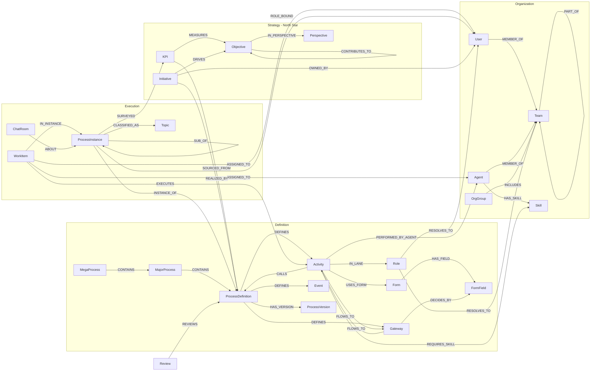

# Process GPT 데이터 온톨로지 설계 — Apache AGE 기반 그래프 데이터베이스

> 상태: 설계 초안 (v0.2) · 작성일: 2026-07-09 · 갱신: 2026-07-10 (전략/KPI 레이어 추가)
> 범위: 현행(AS-IS) 데이터 모델 전수 분석 → 그래프 온톨로지(TO-BE) 설계 → Apache AGE 물리 설계·동기화·로드맵

---

## 1. 목적과 배경

Process GPT의 데이터는 기능별로 서로 다른 인코딩(JSONB 문서, 관계형 테이블, 설정 JSON 트리, 외부 마이크로서비스)에 분산되어 있고, 엔티티 간 관계 대부분이 **문자열 규약으로만** 존재한다(예: `activity.tool = "formHandler:<form_id>"`, `roles[].endpoint = users.id`). 이 관계들을 1급 시민(엣지)으로 승격한 지식그래프를 구축하면 다음이 가능해진다.

1. **영향 분석** — "이 폼 필드/역할/담당자를 바꾸면 어떤 프로세스·게이트웨이·인스턴스가 영향받는가"를 단일 Cypher 질의로.
2. **프로세스 마이닝/분석** — 정의된 흐름 vs 실제 실행 경로, 역할 간 핸드오프, 병목·재작업 분석.
3. **GraphRAG** — 이미 사용 중인 pgvector(`documents`, `chat_vector_memory`)와 결합해 에이전트 답변의 컨텍스트를 그래프 이웃으로 확장.
4. **정합성 검증** — 코드로만 강제되던 참조(FK 부재)를 그래프 제약/검증 질의로 상시 점검.
5. **전략 가시화(북극성)** — BSC 스트레티지 맵(전략목표 간 인과관계) → KPI → 프로세스 → 실행 인스턴스로 이어지는 계보를 실시간 탐색. KPI의 정량 평가(시스템 지표: 실행 건수·소요시간)와 정성 평가(프로세스 완료 후 설문)를 전략 맥락에서 통합 조회한다.

**Apache AGE 선택 이유**: 운영 DB가 자체 호스팅 Supabase(`supabase/postgres:15.8.1`)이므로, AGE(PG15 지원)를 같은 인스턴스에 확장으로 설치하면 **데이터 이동 없이** 관계형(원천) ↔ 그래프(파생 projection) ↔ 벡터(pgvector)를 한 트랜잭션/한 SQL에서 하이브리드 질의할 수 있다.

---

## 2. 현행(AS-IS) 데이터 모델 분석

### 2.1 저장소 지형

| 저장소 | 내용 | 비고 |
|---|---|---|
| Supabase PostgreSQL 15 (`public` 스키마, ~50 테이블) | 정의·실행·조직·폼·채팅·지식·거버넌스 전부 | DDL 원천: `docker-compose/volumes/db/init.sql`, `supabase/migrations/*.sql` |
| pgvector | `documents(embedding vector(1536))` + `match_documents()`, `chat_vector_memory` | RAG/에이전트 메모리 — **이미 설치·사용 중** |
| Supabase Storage | `files`, `chat-images` 버킷 | 파일 원본 |
| 외부 마이크로서비스 | `process-gpt-completion`(실행 엔진), `memento`(RAG), `instance-classifier`(BERTopic 군집), `strategy-service`(Objective/KPI/Initiative), `deepagents`(Git 기반 스킬) | 프런트는 REST로만 접근 |
| Git (GitHub) | 에이전트 스킬(SKILL.md, `extends` 상속) | `tenant_skills`/`agent_skills`로 DB에 투영 |

**BPMN은 3중 표현으로 저장된다** — 온톨로지의 주 원천은 ②:

1. `proc_def.bpmn` — BPMN 2.0 XML (모델러 캔버스용)
2. `proc_def.definition` — JSONB 평탄화 모델 (`activities/events/gateways/sequences/roles/data/subProcesses`) — 엔진·AI 계약
3. `tb_bpmn_model/node/link/lane` — XML을 다시 파싱한 정규화 테이블 (분석용, `hierarchy_level: mega/major/sub`)

**이미 그래프인 데이터가 서로 다른 인코딩에 갇혀 있다:**

| 데이터 | 현재 인코딩 | 그래프 본질 |
|---|---|---|
| 프로세스 맵(Mega→Major→Sub) | `configuration(key='proc_map')` JSON 트리 | 계층 트리 |
| 조직도 | `configuration(key='organization')` JSON 트리 (`data.isTeam`, `children[]`) | 계층 트리 + 소속 |
| 시퀀스 흐름 | `definition.sequences[] {source, target, condition}` | **엣지 리스트 그대로** |
| 업무 의존성 | `task_dependency(task_id, depends_id)` | 인접 리스트 |
| 부서 계층 | `departments(parent_id, path)` | 인접 리스트 |
| BPMN 링크 | `tb_bpmn_link(source_node_id, target_node_id)` | 엣지 리스트 |
| 스킬 참조/상속 | 프런트(`skillReferencesGraph.ts`)에서 **매번 즉석 계산** | ref/extends DAG |
| 서브프로세스 호출 | `subProcesses[].children` 재귀, `called_element` | 콜 그래프 |

### 2.2 도메인별 핵심 테이블 (전수 조사 결과 요약)

#### A. 프로세스 정의 (Definition)

| 테이블 | 핵심 컬럼 | 역할 |
|---|---|---|
| `proc_def` | `uuid`(PK), `id`+`tenant_id`(업무키), `name`, `bpmn`(XML), `definition`(JSONB), `prod_version`, `owner`, `agent_id`, `type`(bpmn/dmn), `is_draft`, `isdeleted` | 정의 현행 head |
| `proc_def_version` | `uuid`(PK), `arcv_id`=`{id}_{version}`, `proc_def_id`, `version`, `version_tag`(published/major/minor), `snapshot`(XML), `definition`(JSONB), `parent_version`, `source_todolist_id`, `timeStamp` | 버전 체인. published는 불변, 재저장 시 minor 자동 분기 |
| `proc_def_snapshots` | `review_id`(FK→approval_state), `stage`, `major/minor_version`, `bpmn_xml`, `bpmn_json` | 승인 단계별 스냅샷(거버넌스) |
| `proc_def_approval_state` | `id`(=review_id), `proc_def_id`, `state`, `hq_status`/`field_status`(병렬 승인), `public_feedback_*`(30일), `version_label`, `root_cause_review_id` | 상태머신: `draft→in_review→public_feedback→final_edit→published→archived` (+`reopen_requested/rejected/cancelled`) |
| `proc_def_approval_history` | `review_id`, `action`, `from_state`→`to_state`, `actor_id` | 전이 감사 로그 |
| `proc_def_comments` | `proc_def_id`, `element_id`, `parent_comment_id`(스레드), `is_resolved`, `reviewer_type`(hq/field/public) | BPMN 요소 단위 리뷰 코멘트 |
| `proc_def_marketplace` | `id`, `definition`, `bpmn`, `category`(`mega/major` 경로 문자열), `tags`, `import_count` | 테넌트 무관 전역 카탈로그 |
| `tb_bpmn_model/node/link/lane` | model: `proc_def_id`, `parent_proc_def_id`, `hierarchy_level`, `domain_id` / node: `element_type`, `task_type`, `event_type`, `called_element`, `lane_id` / link: `source/target_node_id`, `condition_expression` | XML의 정규화 투영 |
| `process_organizations` | `proc_def_id`, `organization_id/name/type` | 프로세스↔조직단위(레인 기반) |
| `configuration(key='proc_map')` | `{mega_proc_list:[{major_proc_list:[{sub_proc_list:[...]}]}]}` | 프로세스 아키텍처 계층 |
| `palette_task_types` | `task_type`(bpmn:UserTask 등), `is_enabled`, `display_order` | 팔레트 설정 |

**`proc_def.definition`(JSONB) 내부 구조** — 온톨로지의 최대 원천:

```
{
  processDefinitionId, processDefinitionName, description, version, megaProcessId, majorProcessId,
  data:      [{name, type, description, defaultValue?}],                  // 프로세스 변수
  roles:     [{name, endpoint: uuid|uuid[]|'external_customer', resolutionRule, default}],
  activities:[{id, name, type: userTask|manualTask|serviceTask|scriptTask, role, tool: 'formHandler:<form_id>',
               agent, agentMode: none|DRAFT|COMPLETE, orchestration: none|default|deepagents|langchain-react|deep-research-custom,
               skills[], inputData: ["formId.fieldId"], outputData[], checkpoints[], duration, instruction,
               description, attachedEvents, customProperties[], properties(JSON string)}],
  gateways:  [{id, name, type: exclusiveGateway|parallelGateway|inclusiveGateway, role,
               conditionData: ["formId.fieldId"], condition, properties}],
  events:    [{id, name, type: startEvent|endEvent|intermediateCatchEvent|intermediateThrowEvent, role, trigger}],
  sequences: [{id, name, source, target, condition, properties}],
  subProcesses: [{id, name, role, type, process, tool, children: {activities, gateways, ..., subProcesses(재귀)}}]
}
```

Role 해석은 uEngine 커널 타입 체계: `org.uengine.kernel.DirectRoleResolutionContext`(직접 사용자), `ExternalCustomerRoleResolutionContext`(외부고객), `IAMRoleResolutionContext`(scope), 커스텀 `'Organization'`(조직도 팀/그룹 바인딩).

#### B. 실행 (Execution)

| 테이블 | 핵심 컬럼 | 역할 |
|---|---|---|
| `bpm_proc_inst` | `proc_inst_id`(PK, 형식 `{proc_def_id}.{uuid}`), `proc_def_id`, `proc_def_version`, `version_tag`, `proc_inst_name`, `root_proc_inst_id`, `parent_proc_inst_id`, `execution_scope`, `current_activity_ids[]`, `participants[]`, `role_bindings`(JSONB `[{name, endpoint:[uid], default:[uid]}]`), `variables_data`(JSONB), `status`(enum), `project_id`, `start/end/due_date` | 프로세스 인스턴스. 서브프로세스는 parent/root 자기참조 트리 |
| `todolist` | `id`(uuid PK), `proc_inst_id`, `root_proc_inst_id`, `proc_def_id`, `activity_id`, `activity_name`, `user_id`(⚠ email 또는 uid), `username`, `assignees`(JSONB), `status`(enum), `tool`, `output`(JSONB), `output_url`, `draft`(JSONB), `draft_status`(enum), `agent_mode`(enum), `agent_orch`(enum), `feedback`, `rework_count`, `retry`, `adhoc`, `duration`, `reference_ids[]`, `project_id`, `query`, `consumer`, `log` | 워크아이템(할일). UI 용어 "worklist"는 이 테이블의 뷰 모델 |
| `events` | `id`, `job_id`, `todo_id`(FK→todolist), `proc_inst_id`, `event_type`(enum 10종), `status`(ASKED/APPROVED/REJECTED), `crew_type`, `data`(JSONB), `timestamp` | 에이전트 실행 이벤트 스트림(고볼륨) |
| `delegation_history` | `task_id`(FK→todolist), `from/to_user_id`, `reason`, `status`(enum) | 업무 위임 이력 |
| `project` / `task_dependency` | `project_id`, `status` / `task_id`→`depends_id`, `type`, `lag/lead_time` | 프로젝트·업무 의존성(간트) |
| `chat_rooms` / `chats` / `chat_attachments` | 방(참여자 JSONB, `context`), 메시지(행당 1건, `messages` JSONB), 첨부 | **프로세스 채팅방 id = `proc_inst_id`** |
| `proc_inst_source` | `proc_inst_id`, `file_name/path/id`, `is_process` | 인스턴스 생성 원천 문서 |

**ENUM 정의(init.sql 원문):**
- `process_status`: `NEW, RUNNING, COMPLETED`
- `todo_status`: `NEW, TODO, IN_PROGRESS, SUBMITTED, PENDING, DONE, CANCELLED`
- `agent_mode`: `DRAFT, COMPLETE`
- `agent_orch`: `crewai-action, openai-deep-research, crewai-deep-research, langchain-react, browser-automation-agent, a2a, visionparse, pdf2bpmn`
- `draft_status`: `STARTED, CANCELLED, COMPLETED, FB_REQUESTED, HUMAN_ASKED, FAILED`
- `event_type_enum`: `task_started, task_completed, tool_usage_started, tool_usage_finished, crew_completed, human_asked, human_response, human_checked, task_working, error`
- `delegation_status`: `REQUESTED, ACCEPTED, REJECTED, COMPLETED`

**실행 API(엔진과의 계약)**: `/completion/complete`(워크아이템 완료/인스턴스 시작 겸용 — `{answer, form_values, process_instance_id, activity_id, ...}`), `/completion/role-binding`(역할→사용자 해석, 서버 측), `/completion/rework-complete`, `/instance-classifier/{toplist,similar,ingest,recluster}`.

#### C. 조직 / 사용자 / Role / 에이전트

| 테이블 | 핵심 컬럼 | 역할 |
|---|---|---|
| `users` | PK **(id uuid, tenant_id)** 복합, `username`, `email`, `role`, `is_admin`, `department_id/name`, **에이전트 필드**: `is_agent`, `agent_type`(agent/pgagent), `alias`, `goal`, `persona`, `endpoint`, `tools`(text), `skills`(text), `model`, `tool_priority`(JSONB), `is_draft` | 사람과 AI 에이전트를 **한 테이블**에 저장 |
| `configuration(key='organization')` | `value.chart` = `{id, name, data:{isTeam, pid, position, ...유저/에이전트 필드}, children[]}` | 조직도 원천(JSON 트리). 리프 노드 id = `users.id` |
| `departments` | `id`(=조직도 노드 id), `name`, `parent_id`, `level`, `path` | 조직도 JSON의 관계형 투영(분석용) |
| `org_chart_groups` / `org_chart_group_teams` | 그룹 / `group_id`↔`team_id` | 트리와 독립적인 횡단 팀 묶음(역할 바인딩 대상) |
| `tenants` | `id`(PK, 서브도메인), `owner`, `mcp`(JSONB), `is_deleted` | 테넌트. 사실상 모든 테이블이 `tenant_id` FK |
| `tenant_skills` / `agent_skills` | `(tenant_id, skill_name, owner_id)` / `(user_id, tenant_id, skill_name)` | 스킬 카탈로그·에이전트 배정(정규화). `users.skills` 문자열과 중복 |
| `user_permissions` | `user_id`, `proc_def_id`, `proc_def_ids`(JSONB), `readable/writable/deployable` | 정의 단위 권한 |
| `standard_terminology` | `category`(task_name/lane_name/...), `term`, `usage_count` | 표준 용어 사전 |

**Role 흐름(end-to-end)**: ① 레인/풀에 `roleResolutionContext` 설계 → ② 정의 JSON `roles[] {name, endpoint, resolutionRule, default}`로 영속 → ③ 실행 시 `/completion/role-binding`이 팀/그룹/scope→구체 사용자 해석 → ④ 인스턴스 `role_bindings`에 확정 저장 → ⑤ 워크아이템 `user_id`/`assignees`로 배정. 요소↔역할 연결은 **`element.role = roles[].name` 문자열 매칭**(폴백 `'Unknown'`).

#### D. 폼 / 데이터

| 테이블 | 핵심 컬럼 | 역할 |
|---|---|---|
| `form_def` | `uuid`(PK), `id`(업무키), `html`(KEditor 커스텀 태그), `fields_json`(파생 메타), `proc_def_id`, `activity_id` | 액티비티당 폼. `id` 자동규칙 `{proc_def_id}_{activity_id}_form`, 기본 `defaultform` |
| `fields_json[]` | `{key, text(라벨), type, items[], disabled, readonly}`, 반복그룹 `row-layout {is_multidata_mode, fields[]}` | 필드 타입: text/select/checkbox/radio/file/label/boolean/textarea/user-select/report/slide/bpmn-uengine |

**필드 참조 규약**: 게이트웨이 `conditionData[]`와 액티비티 `inputData[]`(참조정보)는 모두 `"formId.fieldId"` 문자열 — 분기 판단·참조 데이터의 계보(lineage)가 여기 있다. 폼↔프로세스 변수 연결은 `variableForHtmlFormContext`(activity properties) → `tool: formHandler:<변수명>`.

#### E. 지식 / 전략 / 거버넌스

| 테이블/원천 | 핵심 | 역할 |
|---|---|---|
| `knowledge_files` | `source_type`(drive/upload), `source_ref`, `doc_role`(**content/glossary/template/reference/dataset**), `index_status`, `file_hash` | 지식공간 파일 메타(RAG 인덱싱 대상) |
| `documents` + `match_documents()` | `content`, `metadata`(JSONB), `embedding vector(1536)` | pgvector 임베딩 저장소 |
| `chat_vector_memory` | `room_id`, `agent_id`, `memory_type`(conversation/tool_result/fact/preference), `embedding` | 채팅방 단위 에이전틱 메모리 |
| `agent_knowledge_history` | `knowledge_type`(MEMORY/DMN_RULE/SKILL), `agent_id`, `operation` | 에이전트 지식 변경 이력 |
| `resource_pull_requests` / `resource_pr_reviews` | `resource_type`(**skill/bpmn/dmn**), `status`(OPEN/CHANGES_REQUESTED/APPROVED/MERGED/CLOSED), `branch_name`, `requester/reviewer` | 리소스 PR 워크플로우(Git 연동) |
| SKILL.md (Git) | frontmatter `name, description, extends`(다중 상속) | 스킬 정의·상속 DAG |
| instance-classifier (외부) | `proc_def_id`별 Topic(`topic_id, topic_name, keywords, is_noise`), 유사 인스턴스(`similarity`, `done_outputs`) | 인스턴스 토픽 분류 |

#### F. 전략 / KPI (Strategy Layer)

**두 개의 독립된 KPI 체계가 존재하며 성격이 다르다:**

1. **비즈니스 전략 KPI** — `strategy-service` 마이크로서비스(`/strategy-service/api`, uEngine OSS Process GPT Strategy, 자체 저장소). BSC + 스트레티지 맵 구조. **온톨로지 최상단 레이어의 원천.**
2. **프로세스 배포 파이프라인 KPI** — Supabase `kpi_targets` + `v_kpi_*` 뷰. 정의 승인/배포 거버넌스 지표(도메인별 배포 목표 대비 published 수, 주간 배포 속도). 전략 KPI가 아닌 운영 집계이므로 그래프 미적재(관계형 유지).

**strategy-service 엔티티** (프런트 계약 기준 — `strategyStore.ts`, `StrategyBoard.vue`, `SurveyResponse.vue`):

| 엔티티 | 필드 | 비고 |
|---|---|---|
| Objective(전략목표) | `id, name, description, perspective, parents[]` | `perspective` ∈ **financial / customer / internal_process / learning_growth** (BSC 4관점, `StrategyBoard.vue:7`). **`parents[]`가 스트레티지 맵의 인과관계**(하위 목표가 상위 목표에 기여) |
| KPI | `id, objective_id, name, unit, measure_type, proc_def_id, direction(increase/decrease), target_value, current_value, survey_questions[]` | `measure_type` ∈ **instance_count / avg_duration_hours**(정량·시스템 집계) **/ survey_score**(정성·설문) **/ manual**(수동 입력) (`StrategyBoard.vue:14`). `proc_def_id`로 프로세스 정의에 직결. `/ai/suggest`가 프로세스 후보와 설문 문항을 AI 추천 |
| Initiative(실행과제) | `id, objective_id, name, description, owner_email, status(planned…), progress(0~100), proc_def_id, start_date, due_date` | 목표 달성 수단 — 프로세스와 담당자에 연결 |
| Measurement | KPI별 측정 시계열 (`GET /kpis/{id}/measurements`) | `/measure/run` 배치가 정량 KPI 일괄 갱신 + 설문 일괄 발행 (`{kpis_measured, surveys_dispatched}`) |
| SurveyRequest | `request_id, kpi_id, kpi_name, proc_inst_id, proc_inst_name, questions[], status(→ANSWERED)` | **완료된 프로세스 인스턴스 단위로 발행**되는 정성 평가. 응답 = `[{question, rating(1~5), comment}]` |

**KPI 이중 평가 경로(정량+정성)가 데이터에 이미 구현되어 있다:**

- **정량**: `measure_type = instance_count / avg_duration_hours` → `kpi.proc_def_id` 기준 `bpm_proc_inst` 집계(실행 건수·평균 소요시간). 시스템 데이터 기반.
- **정성**: `measure_type = survey_score` → 인스턴스 완료 시 설문 발행(`survey.proc_inst_id`) → rating(1~5) 집계. 사용자 경험 기반.

**레거시**: `configuration(key='strategy')`의 BSC 카드 JSON(`getBSCard`/`putBSCard`, `ProcessGPTBackend.ts:1899-1939`) → `/import-bscard`로 strategy-service에 이관.

### 2.3 암묵적 관계 인벤토리 — "코드로만 존재하는 엣지"

온톨로지화의 핵심 근거. 현재 아래 관계는 DB FK도, 명시적 테이블도 없이 **문자열 규약 + 애플리케이션 코드**로만 유지된다.

| # | 관계 | 현재 규약 | 강제 위치 |
|---|---|---|---|
| 1 | 액티비티 → 폼 | `activity.tool == 'formHandler:' + form_def.id` | 프런트 파싱 |
| 2 | 게이트웨이/액티비티 → 폼 필드 | `conditionData[]`/`inputData[]` = `"formId.fieldId"` | 프런트 파싱 |
| 3 | 요소 → 역할(레인) | `element.role == roles[].name` 문자열 매칭 (폴백 `'Unknown'`) | 파서 |
| 4 | 역할 → 사용자/팀/그룹 | `roles[].endpoint`/`default` = `users.id`(UUID) 또는 `'external_customer'`, Organization 타입은 조직도 노드/그룹 id | 프런트+엔진 |
| 5 | 인스턴스 → 정의 | `proc_inst_id = "{proc_def_id}.{uuid}"` 접두 파싱 + `proc_def_id` 컬럼(코드 FK) | 코드 |
| 6 | 워크아이템 → 액티비티 | `todolist.activity_id == definition.activities[].id` | 코드 |
| 7 | 채팅방/메시지 → 인스턴스 | `chat_rooms.id == chats.id == proc_inst_id` | 코드 |
| 8 | 조직도 → 사용자/부서 | 조직도 JSON 노드 id == `users.id` == `departments.id` == `users.department_id` | 동기화 코드 |
| 9 | 에이전트 → 스킬 | `users.skills`(콤마 문자열) ↔ `agent_skills` 이중 저장 | `putAgent` 미러링 |
| 10 | 정의 → 프로세스 맵 위치 | `definition.megaProcessId/majorProcessId` ↔ `configuration.proc_map` JSON ↔ `tb_bpmn_model.parent_proc_def_id/hierarchy_level` **3중 표현** | 각자 코드 |
| 11 | 콜액티비티 → 하위 정의 | `subProcesses[].process` / `tb_bpmn_node.called_element` | 엔진 |
| 12 | 버전 계보 | `arcv_id = "{proc_def_id}_{version}"`, `parent_version`, `prod_version` 문자열 매칭 | 코드 |
| 13 | 위임 체인 | `delegation_history.task_id` → todolist (이것만 실제 FK 있음) | DB |
| 14 | KPI → 프로세스 | `kpi.proc_def_id == proc_def.id` — **마이크로서비스 경계를 넘는** 문자열 참조 | strategy-service |
| 15 | 실행과제 → 프로세스/담당자 | `initiative.proc_def_id == proc_def.id`, `initiative.owner_email == users.email` | strategy-service |
| 16 | 전략맵 인과관계 | `objective.parents[] == objective.id` | strategy-service |
| 17 | 설문 → 인스턴스 | `survey.proc_inst_id == bpm_proc_inst.proc_inst_id` (서비스 경계) | strategy-service |

### 2.4 데이터 품질·일관성 이슈 (그래프 적재 시 처리 필요)

1. **`variables_data` 형태 이중성** — `setVariable`은 객체(`{key: value}`) 병합, `getProcessVariables`는 배열(`[{key, value}]`)로 읽음. 적재 시 두 형태 모두 파싱.
2. **`todolist.user_id`에 email/uid 혼용** — User 노드 MERGE 시 email·uid 양쪽 매칭 필요.
3. **역할 문자열 매칭** — `role='Unknown'` 폴백 존재. 그래프에서는 미해석 역할로 명시(`Role {name:'Unknown'}` 별도 취급).
4. **DB FK 부재** — `proc_def_id`, `proc_inst_id` 등 코드 강제. 고아 참조가 실제 존재할 수 있으므로 적재 시 dangling 노드 리포트.
5. **`users.skills` 문자열 vs `agent_skills` 테이블 중복** — 정규화 테이블을 정본으로 채택.
6. **프로세스 계층 3중 표현**(#10) — `proc_map` JSON을 정본으로 채택하고 `tb_bpmn_model.hierarchy_level`은 검증용.
7. **`timeStamp`(camelCase) vs `created_at` 혼용** — 버전 정렬 로직이 경로마다 다름.

---

## 3. 온톨로지 설계 (TO-BE)

### 3.1 설계 원칙

1. **6레이어 분리** — **Strategy(전략·KPI, 최상단)** / Definition(정적 구조) / Execution(런타임 트레이스) / Organization(행위자) / Knowledge(지식·스킬) / Governance(버전·승인·PR). 레이어 간 연결은 명시적 엣지로만. 전략 레이어가 "왜(Why)", 정의 레이어가 "무엇(What)", 실행 레이어가 "실제로 어떻게(How)"를 담당하며, `전략목표 → KPI → 프로세스 → 인스턴스`의 수직 계보가 북극성 지표의 가시화 경로다.
2. **AGE 제약 반영** — AGE는 vertex당 **단일 label**. 다중 라벨 대신 label = 최상위 분류, 세부 유형은 `type` 속성(예: `Activity {type:'userTask'}`).
3. **자연키 보존** — 모든 노드에 원천 테이블 PK(`id`, `uuid`, `tenant_id`)를 속성으로 유지 → 관계형↔그래프 왕복 조인 가능. 그래프는 **원천이 아니라 파생 projection**(원천 테이블·엔진 무변경).
4. **고볼륨 데이터는 그래프 밖** — `chats` 메시지, `events` 스트림, 임베딩 벡터는 관계형/벡터에 남기고, 그래프에는 집계·앵커(방, 워크아이템)만. 그래프는 "관계 인덱스"다.
5. **n-ary 관계는 reification** — 위임(from/to/task/사유), 리뷰(HQ/현업/상태), 역할해석(규칙/대상)처럼 관계 자체가 속성·이력을 갖는 것은 노드로 승격.
6. **SequenceFlow는 엣지** — 조건·이름은 엣지 속성. 흐름 탐색이 온톨로지의 최빈 질의이므로 노드 reification 비용을 피한다.

### 3.2 노드 카탈로그

공통 속성(전 노드): `tenant_id`, `created_at`, `updated_at` (이하 표에서 생략)

#### Strategy 레이어 (최상단)

| Label | 키 | 주요 속성 | 원천 |
|---|---|---|---|
| `Perspective` | `(tenant_id, id)` | `id`(financial/customer/internal_process/learning_growth), `name`, `order` | BSC 4관점 — 테넌트별 시드 데이터(추가 관점 확장 가능) |
| `Objective` | `id` | `name`, `description` | strategy-service objectives |
| `KPI` | `id` | `name`, `unit`, `measure_type`(instance_count/avg_duration_hours/survey_score/manual), `direction`(increase/decrease), `target_value`, `current_value`, `last_measured_at`, `survey_questions`(json) | strategy-service kpis |
| `Initiative` | `id` | `name`, `description`, `status`(planned/…), `progress`, `start_date`, `due_date` | strategy-service initiatives |

측정 시계열(Measurement)과 설문 응답 원문(rating/comment)은 strategy-service 저장소에 유지한다(원칙 4 — 고볼륨·시계열은 그래프 밖). KPI 노드에는 최신 측정값(`current_value`, `last_measured_at`)만 속성으로 반영하고, 설문의 인스턴스 단위 계보는 `SURVEYED` 엣지로 표현한다.

#### Definition 레이어

| Label | 키 | 주요 속성 | 원천 |
|---|---|---|---|
| `Tenant` | `id` | `owner` | `tenants` |
| `MegaProcess` | `id` | `name` | `configuration('proc_map')` |
| `MajorProcess` | `id` | `name` | `configuration('proc_map')` |
| `ProcessDefinition` | `id` (+`uuid`) | `name`, `description`, `type`(bpmn/dmn), `owner`, `prod_version`, `is_draft`, `is_deleted` | `proc_def` |
| `ProcessVersion` | `uuid` (+`arcv_id`) | `version`, `version_tag`(published/major/minor), `message`, `timestamp`, `parent_version` | `proc_def_version` |
| `Activity` | `(proc_def_id, element_id)` | `name`, `type`(userTask/serviceTask/scriptTask/manualTask/**subProcess/callActivity**), `duration`, `instruction`, `description`, `agent_mode`, `orchestration`, `checkpoints`(json), `adhoc?` | `definition.activities[]`, `subProcesses[]` |
| `Event` | `(proc_def_id, element_id)` | `name`, `type`(startEvent/endEvent/intermediateCatch/Throw/boundary), `trigger`, `event_definition`(timer/message/...) | `definition.events[]`, `tb_bpmn_node` |
| `Gateway` | `(proc_def_id, element_id)` | `name`, `type`(exclusive/parallel/inclusive), `condition` | `definition.gateways[]` |
| `Role` | `(proc_def_id, name)` | `name`, `resolution_rule` | `definition.roles[]` |
| `Variable` | `(proc_def_id, name)` | `name`, `type`, `description`, `default_value` | `definition.data[]` |
| `Form` | `id` (+`uuid`) | `proc_def_id`, `activity_id` | `form_def` |
| `FormField` | `(form_id, key)` | `key`, `label`, `type`, `items`(json), `is_multidata` | `form_def.fields_json[]` |

#### Organization 레이어

| Label | 키 | 주요 속성 | 원천 |
|---|---|---|---|
| `User` | `(id, tenant_id)` | `username`, `email`, `role`, `is_admin` | `users` (is_agent=false) |
| `Agent` | `(id, tenant_id)` | `alias`, `username`, `goal`, `persona`, `model`, `agent_type`(agent/pgagent), `endpoint`, `tools` | `users` (is_agent=true) |
| `Team` | `id` | `name`, `level`, `path` | 조직도 JSON(isTeam) / `departments` |
| `OrgGroup` | `id` | `name`, `description` | `org_chart_groups` |

#### Execution 레이어

| Label | 키 | 주요 속성 | 원천 |
|---|---|---|---|
| `ProcessInstance` | `id`(proc_inst_id) | `name`, `status`(NEW/RUNNING/COMPLETED), `start/end/due_date`, `execution_scope`, `current_activity_ids`(json), `version`, `version_tag` | `bpm_proc_inst` |
| `WorkItem` | `id`(uuid) | `activity_id`, `activity_name`, `status`(todo_status), `agent_mode`, `agent_orch`, `draft_status`, `start/end/due_date`, `duration`, `rework_count`, `retry`, `adhoc`, `tool`, `output_url` | `todolist` (output/draft JSONB는 관계형 유지) |
| `Delegation` | `id` | `reason`, `status`, `created_at`, `responded_at` | `delegation_history` (reified) |
| `Project` | `project_id` | `name`, `status`, `start/end/due_date` | `project` |
| `ChatRoom` | `id` | `name`, `primary_agent_id` | `chat_rooms` (메시지는 관계형 유지) |
| `Topic` | `(proc_def_id, topic_id)` | `name`, `keywords`, `is_noise`, `count` | instance-classifier |

#### Knowledge / Governance 레이어

> **[보류]** Review·ResourcePR·Terminology와 거버넌스 엣지 10종은 2026-07-10 결정으로 보류 — 스펙만 유지하고 라벨은 만들지 않는다(Phase 4에서 활성화).

| Label | 키 | 주요 속성 | 원천 |
|---|---|---|---|
| `Skill` | `(tenant_id, name)` | `name`, `description` | `tenant_skills` + SKILL.md |
| `KnowledgeDoc` | `id` | `file_name`, `doc_role`(content/glossary/template/reference/dataset), `source_type`, `source_ref`, `folder_path`, `index_status` | `knowledge_files` |
| `Review` | `id`(review_id) | `state`(9종 상태머신), `version_label`, `major/minor_version`, `hq_status`, `field_status`, `submitted_at`, `published_at` | `proc_def_approval_state` |
| `ResourcePR` | `id` | `resource_type`(skill/bpmn/dmn), `status`, `branch_name`, `git_pr_url` | `resource_pull_requests` |
| `Terminology`(선택) | `(category, term)` | `category`, `term`, `usage_count` | `standard_terminology` |

### 3.3 엣지 카탈로그

#### 전략 (Strategy) — 북극성 계보

| 엣지 | 속성 | 원천 규약 |
|---|---|---|
| `(Objective)-[:IN_PERSPECTIVE]->(Perspective)` | — | `objective.perspective` |
| `(Objective)-[:CONTRIBUTES_TO]->(Objective)` | — | `objective.parents[]` — **스트레티지 맵 인과관계**(하위 목표 → 상위 목표 기여, 예: 학습·성장 → 내부프로세스 → 고객 → 재무) |
| `(KPI)-[:MEASURES]->(Objective)` | — | `kpi.objective_id` |
| `(Initiative)-[:DRIVES]->(Objective)` | — | `initiative.objective_id` |
| `(KPI)-[:SOURCED_FROM]->(ProcessDefinition)` | `measure_type` | `kpi.proc_def_id` — **정량 지표의 집계 원천**(instance_count/avg_duration_hours ← `bpm_proc_inst`)이자 **설문 발행 대상 프로세스**(survey_score) |
| `(Initiative)-[:REALIZED_BY]->(ProcessDefinition)` | — | `initiative.proc_def_id` — 실행과제의 실현 수단 프로세스 |
| `(Initiative)-[:OWNED_BY]->(User)` | — | `initiative.owner_email` |
| `(ProcessInstance)-[:SURVEYED]->(KPI)` | `request_id`, `status`, `avg_rating`, `answered_at` | strategy-service surveys — **정성 평가의 인스턴스 단위 계보**(완료 인스턴스 → 설문 → KPI) |

> 정량·정성 이중 평가의 그래프 표현: 같은 KPI 노드가 ① `SOURCED_FROM` 엣지(+`measure_type` 속성)로 시스템 지표의 원천 프로세스에, ② 인스턴스들의 `SURVEYED` 엣지로 사용자 경험 평가에 연결된다. 두 경로의 비교(정량은 좋은데 정성이 낮은 프로세스)가 §6 Q10이다.

#### 정의 구조

| 엣지 | 속성 | 원천 규약 |
|---|---|---|
| `(Tenant)-[:OWNS]->(ProcessDefinition)` | — | `proc_def.tenant_id` |
| `(MegaProcess)-[:CONTAINS]->(MajorProcess)-[:CONTAINS]->(ProcessDefinition)` | `order` | `proc_map` JSON + `definition.megaProcessId/majorProcessId` |
| `(ProcessDefinition)-[:HAS_VERSION]->(ProcessVersion)` | — | `proc_def_version.proc_def_id` |
| `(ProcessDefinition)-[:PRODUCTION]->(ProcessVersion)` | — | `proc_def.prod_version` 매칭 |
| `(ProcessVersion)-[:DERIVED_FROM]->(ProcessVersion)` | — | `parent_version` |
| `(ProcessDefinition)-[:DEFINES]->(Activity\|Event\|Gateway\|Role\|Variable)` | — | 현행 head의 `definition` JSON |
| `(요소)-[:FLOWS_TO]->(요소)` | `seq_id`, `name`, `condition` | `sequences[] {source→target}` |
| `(Activity)-[:CONTAINS]->(하위 요소)` | — | `subProcesses[].children` 재귀 (type=subProcess) |
| `(Activity{callActivity})-[:CALLS]->(ProcessDefinition)` | — | `called_element` / `subProcesses[].process` |
| `(요소)-[:IN_LANE]->(Role)` | — | `element.role == roles[].name` |
| `(Role)-[:RESOLVES_TO]->(User\|Team\|OrgGroup)` | `kind`(direct/default/organization/external/iam), `rule` | `roles[].endpoint/default`, Organization 바인딩, `process_organizations` |
| `(Activity)-[:USES_FORM]->(Form)` | — | `tool='formHandler:<id>'` |
| `(Form)-[:HAS_FIELD]->(FormField)` | `order` | `fields_json[]` |
| `(Activity)-[:REFERENCES]->(FormField)` | `as`('input') | `inputData[] "formId.fieldId"` |
| `(Gateway)-[:DECIDES_BY]->(FormField)` | — | `conditionData[]` |
| `(FormField)-[:BINDS_TO]->(Variable)` | — | `variableForHtmlFormContext` |
| `(Activity)-[:PERFORMED_BY_AGENT]->(Agent)` | `mode`(DRAFT/COMPLETE), `orchestration` | `activity.agent`, `agentMode` |
| `(Activity)-[:REQUIRES_SKILL]->(Skill)` | — | `activity.skills[]` |
| `(ProcessDefinition)-[:INVOLVES]->(Team)` | `organization_type` | `process_organizations` |

#### 조직

| 엣지 | 속성 | 원천 |
|---|---|---|
| `(User\|Agent)-[:MEMBER_OF]->(Team)` | `position` | 조직도 JSON / `users.department_id` |
| `(Team)-[:PART_OF]->(Team)` | — | 조직도 `children` / `departments.parent_id` |
| `(OrgGroup)-[:INCLUDES]->(Team)` | — | `org_chart_group_teams` |
| `(Agent)-[:HAS_SKILL]->(Skill)` | — | `agent_skills` |
| `(Skill)-[:EXTENDS]->(Skill)` | — | SKILL.md frontmatter |

#### 실행

| 엣지 | 속성 | 원천 |
|---|---|---|
| `(ProcessInstance)-[:INSTANCE_OF]->(ProcessDefinition)` | `version`, `version_tag` | `proc_def_id` + `proc_def_version` |
| `(ProcessInstance)-[:SUB_OF]->(ProcessInstance)` | `execution_scope` | `parent_proc_inst_id` (root는 경로 집계로 도출, 필요시 `:ROOT_OF` 지름길 추가) |
| `(WorkItem)-[:IN_INSTANCE]->(ProcessInstance)` | — | `proc_inst_id` |
| `(WorkItem)-[:EXECUTES]->(Activity)` | — | `(proc_def_id, activity_id)` 매칭 |
| `(WorkItem)-[:ASSIGNED_TO]->(User\|Agent)` | `kind`(single/multi) | `user_id`(email/uid 정규화), `assignees` |
| `(ProcessInstance)-[:ROLE_BOUND]->(User)` | `role_name`, `is_default` | `role_bindings` JSONB |
| `(WorkItem)-[:DEPENDS_ON]->(WorkItem)` | `type`, `lag_time`, `lead_time` | `task_dependency` |
| `(Delegation)-[:DELEGATION_OF]->(WorkItem)`, `(Delegation)-[:DELEGATION_FROM]->(User)`, `(Delegation)-[:DELEGATION_TO]->(User)` | — | `delegation_history` (엣지 라벨은 그래프 전역이므로 범용 명칭 OF/FROM/TO 대신 접두 명칭 사용) |
| `(ProcessInstance)-[:CLASSIFIED_AS]->(Topic)` | `similarity?` | instance-classifier ingest |
| `(ChatRoom)-[:ABOUT]->(ProcessInstance)` | — | `chat_rooms.id == proc_inst_id` |
| `(User\|Agent)-[:PARTICIPATES_IN]->(ChatRoom)` | — | `participants` JSONB |
| `(ProcessInstance)-[:IN_PROJECT]->(Project)` | — | `project_id` |
| `(ProcessInstance)-[:ORIGINATED_FROM]->(KnowledgeDoc)` | — | `proc_inst_source`(file_id 매칭 가능 시). `SOURCED_FROM`(KPI→정의)과 구분 |

#### 거버넌스 — **[보류]** (2026-07-10 결정, Phase 4에서 활성화)

| 엣지 | 속성 | 원천 |
|---|---|---|
| `(Review)-[:REVIEWS]->(ProcessDefinition)` | — | `proc_def_approval_state.proc_def_id` |
| `(User)-[:SUBMITTED\|:HQ_REVIEWED\|:FIELD_REVIEWED\|:PUBLISHED\|:REJECTED]->(Review)` | `status`, `at`, `comment` | approval_state 컬럼들 |
| `(Review)-[:FOLLOWS]->(Review)` | — | `root_cause_review_id` (reopen 계보) |
| `(ResourcePR)-[:TARGETS]->(Skill\|ProcessDefinition)` | — | `resource_type` + `resource_id` |
| `(User)-[:REQUESTED\|:REVIEWS_PR]->(ResourcePR)` | `action`, `comment` | PR 테이블 + reviews |
| `(ProcessVersion)-[:TRIGGERED_BY]->(WorkItem)` | — | `source_todolist_id` (피드백→minor 버전 계보) |

### 3.4 레이어 개요 다이어그램



### 3.5 버전 정확성에 대한 결정

- **Phase 1**: 요소(Activity/Gateway/...) 서브그래프는 **정의 현행 head 기준 1벌**만 유지(`(ProcessDefinition)-[:DEFINES]->`), `ProcessVersion`은 메타데이터 노드로만 적재. 인스턴스는 `INSTANCE_OF {version}` 엣지 속성으로 어떤 버전이었는지 기록.
- **Phase 2(선택)**: 실행 이력 분석의 버전 정확성이 필요해지면, *인스턴스가 존재하는 버전에 한해* `(ProcessVersion)-[:DEFINES]->(요소)` 서브그래프를 lazy materialize. 이유: 버전마다 요소를 복제하면 노드 수가 버전 수에 비례해 폭증하는데, 실제 질의 대부분은 현행 정의 기준이다.

---

## 4. Apache AGE 물리 설계

### 4.1 설치 (자체 호스팅 supabase/postgres:15)

AGE `release/PG15/1.5.0` 브랜치를 기존 이미지에 빌드:

```dockerfile
FROM supabase/postgres:15.8.1.060
RUN apt-get update && apt-get install -y --no-install-recommends \
      build-essential postgresql-server-dev-15 git flex bison \
 && git clone --depth 1 --branch release/PG15/1.5.0 https://github.com/apache/age.git /tmp/age \
 && cd /tmp/age && make && make install \
 && rm -rf /tmp/age && apt-get purge -y build-essential git && apt-get autoremove -y
```

```sql
CREATE EXTENSION IF NOT EXISTS age;
-- 세션마다: LOAD 'age'; SET search_path = ag_catalog, "$user", public;
-- 상시 사용 커넥션은 ALTER ROLE <svc_role> SET session_preload_libraries = 'age';
SELECT ag_catalog.create_graph('process_gpt');
```

**보안 주의**: 그래프 데이터는 `process_gpt` 스키마의 내부 테이블에 저장되며 **RLS가 적용되지 않는다**. PostgREST에 해당 스키마를 노출하지 말고, 그래프 질의는 반드시 백엔드 서비스(service role)를 통해서만 수행한다. 모든 질의에 `tenant_id` 필터를 서비스 계층에서 강제한다.

### 4.2 테넌시 전략

**권장: 단일 그래프 `process_gpt` + 전 노드 `tenant_id` 속성.**
- 현행 시스템과 동일한 모델(`public.tenant_id()` 함수 + RLS 패턴의 그래프 판).
- 마켓플레이스(테넌트 무관)·크로스 테넌트 운영 분석이 자연스럽다.
- 테넌트 수가 늘어도 그래프/스키마 수가 늘지 않아 관리 단순.

대안(격리 요건 강화 시): 테넌트별 그래프 `g_<tenant_id>` — 완전 격리·테넌트 삭제가 `drop_graph` 한 방이지만, 그래프 수만큼 스키마가 늘고 전역 질의가 불가능해진다. Phase 1은 단일 그래프로 시작하고, 규제/격리 요구가 생기면 대형 테넌트만 분리하는 하이브리드로 전환한다.

### 4.3 라벨·인덱스 DDL

> **실행 가능한 스키마 정본은 [`ontology/`](../../ontology/README.md)** — `SCHEMA.md`(계약: 노드 29종·엣지 47종·키·카디널리티, Governance 3/10종 보류)와 `schema/00~03-*.sql`(멱등 DDL, PG15+AGE 1.6 검증·라이브 supabase-db 적용 완료). 아래는 개념 설명용 발췌다.

AGE는 라벨별 내부 테이블(`process_gpt."<Label>"`)을 만든다. 자주 조회하는 키에 표현식 인덱스를 수동 생성한다:

```sql
-- 라벨 사전 생성(선택 — 첫 MERGE 시 자동 생성되지만 명시가 깔끔)
SELECT create_vlabel('process_gpt', 'ProcessDefinition');
SELECT create_vlabel('process_gpt', 'Activity');
SELECT create_elabel('process_gpt', 'FLOWS_TO');
-- ... (3.2/3.3 카탈로그 전체)

-- 키 조회용 btree 표현식 인덱스 (노드 MERGE 성능의 핵심)
CREATE INDEX IF NOT EXISTS idx_pd_key ON process_gpt."ProcessDefinition"
  (agtype_access_operator(properties, '"id"'::agtype),
   agtype_access_operator(properties, '"tenant_id"'::agtype));
CREATE INDEX IF NOT EXISTS idx_act_key ON process_gpt."Activity"
  (agtype_access_operator(properties, '"proc_def_id"'::agtype),
   agtype_access_operator(properties, '"element_id"'::agtype));
CREATE INDEX IF NOT EXISTS idx_wi_key ON process_gpt."WorkItem"
  (agtype_access_operator(properties, '"id"'::agtype));
CREATE INDEX IF NOT EXISTS idx_pi_key ON process_gpt."ProcessInstance"
  (agtype_access_operator(properties, '"id"'::agtype));
-- 범용 속성 검색용 GIN (필요 라벨에만)
CREATE INDEX IF NOT EXISTS gin_pd ON process_gpt."ProcessDefinition" USING gin (properties);
```

### 4.4 질의 패턴

```sql
-- 기본형
SELECT * FROM cypher('process_gpt', $$
  MATCH (d:ProcessDefinition {tenant_id: 'uengine', id: 'vacation_request'})
        -[:DEFINES]->(a:Activity)-[:IN_LANE]->(r:Role)
  RETURN a.name, r.name
$$) AS (activity agtype, role agtype);

-- 하이브리드: 그래프 결과 ↔ 관계형 원천 조인 (AGE 최대 강점)
WITH impacted AS (
  SELECT (d_id::text) AS def_id
  FROM cypher('process_gpt', $$
    MATCH (ff:FormField {form_id:'vacationForm', key:'days'})<-[:DECIDES_BY]-(:Gateway)
          <-[:DEFINES]-(d:ProcessDefinition)
    RETURN d.id
  $$) AS (d_id agtype)
)
SELECT t.id, t.activity_name, t.status
FROM public.todolist t
JOIN impacted i ON t.proc_def_id = trim(both '"' from i.def_id)
WHERE t.status IN ('TODO','IN_PROGRESS');
```

주의사항: agtype↔text 캐스팅(따옴표 제거) 헬퍼 함수를 만들어 두면 편하다. `cypher()` 호출의 그래프명·질의문은 리터럴이어야 하므로 동적 질의는 `EXECUTE format(...)`으로 감싼다(파라미터는 3번째 인자 agtype 맵 사용).

---

## 5. 동기화 아키텍처

**원칙: 원천 무변경.** 엔진(`process-gpt-completion`)과 프런트는 계속 기존 테이블에 쓴다. 그래프는 파생 projection으로, 변경 빈도에 따라 3가지 경로로 동기화한다.

```
[proc_def 저장/발행]  ──trigger──▶ 정의 서브그래프 재구축 함수 (정의 1건 단위 delete+rebuild)
[configuration 변경]  ──trigger──▶ org/proc_map 서브그래프 재구축
[bpm_proc_inst,todolist,
 delegation, chat_rooms] ──trigger──▶ graph_sync_outbox ──pg_cron(10~30s) 워커──▶ 증분 MERGE
[chats, events, embeddings]          (그래프 미적재 — 관계형/벡터 유지)
[strategy-service /map,/surveys] ──워커 주기 pull──▶ 전략 서브그래프 재구축  ※ 외부 µsvc — DB 트리거 불가
```

### 5.1 Outbox 테이블

```sql
CREATE TABLE IF NOT EXISTS public.graph_sync_outbox (
  seq bigserial PRIMARY KEY,
  src_table text NOT NULL,          -- 'bpm_proc_inst' | 'todolist' | ...
  op text NOT NULL,                 -- 'UPSERT' | 'DELETE'
  pk jsonb NOT NULL,                -- {"proc_inst_id": "..."} 등
  tenant_id text,
  enqueued_at timestamptz DEFAULT now(),
  processed_at timestamptz
);
CREATE INDEX ON public.graph_sync_outbox (processed_at) WHERE processed_at IS NULL;
```

행 트리거는 `INSERT INTO graph_sync_outbox ...` 한 줄만 수행(원천 쓰기 경로에 부하 최소화). 워커(pg_cron의 plpgsql 프로시저 또는 소형 사이드카 서비스)가 미처리 행을 배치로 읽어 MERGE 후 `processed_at`을 찍는다. 실패 시 재시도 가능(멱등 MERGE).

### 5.2 정의 서브그래프 재구축 (스켈레톤)

정의류는 저볼륨·문서 단위 변경이므로 "부분 갱신"보다 **해당 정의의 요소·엣지를 지우고 다시 그리는** 편이 단순하고 안전하다:

```sql
CREATE OR REPLACE FUNCTION graph_project_proc_def(p_tenant text, p_def_id text)
RETURNS void LANGUAGE plpgsql AS $fn$
DECLARE
  v_def jsonb;
  v_el jsonb;
BEGIN
  SELECT definition INTO v_def FROM public.proc_def
   WHERE tenant_id = p_tenant AND id = p_def_id AND isdeleted = false;

  -- 1) 기존 요소 서브그래프 제거 (정의 노드는 유지)
  EXECUTE format($q$ SELECT * FROM cypher('process_gpt', $$
      MATCH (d:ProcessDefinition {tenant_id:%L, id:%L})-[:DEFINES]->(e) DETACH DELETE e
    $$) AS (x agtype) $q$, p_tenant, p_def_id);

  -- 2) 정의 노드 MERGE
  EXECUTE format($q$ SELECT * FROM cypher('process_gpt', $$
      MERGE (d:ProcessDefinition {tenant_id:%L, id:%L})
      SET d.name = %L, d.updated_at = %L
    $$) AS (x agtype) $q$, p_tenant, p_def_id,
    coalesce(v_def->>'processDefinitionName',''), now()::text);

  -- 3) activities/gateways/events/roles/variables 순회 MERGE
  FOR v_el IN SELECT * FROM jsonb_array_elements(coalesce(v_def->'activities','[]'::jsonb)) LOOP
    -- MERGE (a:Activity {proc_def_id, element_id}) SET ... ;
    -- tool LIKE 'formHandler:%' → (a)-[:USES_FORM]->(Form) MERGE
    -- inputData[] "form.field" → (a)-[:REFERENCES]->(FormField) MERGE
    -- role → (a)-[:IN_LANE]->(Role) MERGE
    NULL; -- (요소별 MERGE 상세는 구현 단계에서)
  END LOOP;
  -- 4) sequences[] → FLOWS_TO, subProcesses[] → CONTAINS/CALLS 재귀
END $fn$;
```

### 5.3 초기 백필 순서

의존성 순서대로 1회 실행: ① tenants → ② 조직(`configuration('organization')`, departments, groups) → ③ users/agents/skills → ④ proc_map(Mega/Major) → ⑤ proc_def + definition 순회(요소·역할·폼·필드·흐름) → ⑥ 버전/리뷰/PR → ⑦ 인스턴스 → ⑧ 워크아이템/위임/의존성 → ⑨ 채팅방/토픽/지식문서 → ⑩ 전략(Perspective 시드 → Objective(+CONTRIBUTES_TO) → KPI → Initiative → SURVEYED 엣지).

### 5.4 strategy-service 동기화 (외부 마이크로서비스)

strategy-service는 자체 저장소를 가진 별도 서비스라 Supabase 트리거를 걸 수 없다. 원천 무변경 원칙을 유지하는 **pull 방식**으로 시작한다:

- 동기화 워커가 주기(예: 5분)로 테넌트별 `GET /map`(objectives + kpis + initiatives)과 `GET /surveys`를 pull → 전략 서브그래프를 정의류와 동일한 delete+rebuild 패턴으로 재구축(저볼륨이므로 충분).
- `/measure/run` 배치 후의 KPI `current_value` 변화도 같은 pull 주기로 그래프에 반영된다. 북극성 대시보드의 실시간성 요구가 높아지면 strategy-service에 측정 완료 webhook을 추가한다(2차).
- `kpi.proc_def_id` / `initiative.proc_def_id` / `survey.proc_inst_id`는 **마이크로서비스 경계를 넘는 문자열 참조**다. MERGE 시 대상 노드(ProcessDefinition/ProcessInstance)가 그래프에 없으면 dangling 리포트에 적재한다(§2.4-4와 동일 처리). 이 검증 자체가 전략-실행 정합성 감시 기능이 된다.
- `initiative.owner_email`은 email 기반이므로 §2.4-2의 사용자 resolver(email→uid)를 공용한다.

규모 감각: 정의·조직·폼은 테넌트당 수백~수천 노드, 실행 레이어가 지배적(인스턴스·워크아이템). 워크아이템 100만 건 수준까지는 단일 PG의 AGE로 충분히 감당 가능하며, 그 이상은 실행 레이어의 보존 기간 정책(완료 후 N개월 경과분 그래프에서 archive)으로 제어한다.

---

## 6. 대표 질의 시나리오 (가치 증명)

```sql
-- Q1. 영향 분석: 이 폼 필드를 바꾸면 어떤 게이트웨이 분기·프로세스·진행중 업무가 영향받나
SELECT * FROM cypher('process_gpt', $$
  MATCH (ff:FormField {tenant_id:'uengine', form_id:'loanForm', key:'amount'})
  OPTIONAL MATCH (ff)<-[:DECIDES_BY]-(g:Gateway)<-[:DEFINES]-(d1:ProcessDefinition)
  OPTIONAL MATCH (ff)<-[:REFERENCES]-(a:Activity)<-[:DEFINES]-(d2:ProcessDefinition)
  RETURN g.name, d1.name, a.name, d2.name
$$) AS (gateway agtype, def1 agtype, activity agtype, def2 agtype);

-- Q2. 조직 리스크: 이 사용자가 빠지면 영향받는 역할/프로세스/진행중 인스턴스
SELECT * FROM cypher('process_gpt', $$
  MATCH (u:User {email:'kim@corp.com'})
  OPTIONAL MATCH (r:Role)-[:RESOLVES_TO]->(u)
  OPTIONAL MATCH (pi:ProcessInstance {status:'RUNNING'})-[:ROLE_BOUND]->(u)
  OPTIONAL MATCH (w:WorkItem)-[:ASSIGNED_TO]->(u) WHERE w.status IN ['TODO','IN_PROGRESS']
  RETURN collect(DISTINCT r.name), collect(DISTINCT pi.name), count(w)
$$) AS (roles agtype, running_instances agtype, open_workitems agtype);

-- Q3. 역할 간 핸드오프 맵 (조직 정렬 분석: 어떤 역할끼리 업무가 넘어가나)
SELECT * FROM cypher('process_gpt', $$
  MATCH (a1:Activity)-[:FLOWS_TO*1..2]->(a2:Activity),
        (a1)-[:IN_LANE]->(r1:Role), (a2)-[:IN_LANE]->(r2:Role)
  WHERE r1.name <> r2.name
  RETURN r1.name, r2.name, count(*) AS handoffs ORDER BY handoffs DESC
$$) AS (from_role agtype, to_role agtype, handoffs agtype);

-- Q4. 프로세스 콜 그래프: 이 정의를 바꾸면 어떤 상위 프로세스가 영향받나 (역방향 CALLS 추적)
SELECT * FROM cypher('process_gpt', $$
  MATCH path = (top:ProcessDefinition)-[:DEFINES]->(:Activity)-[:CALLS*1..5]->(d:ProcessDefinition {id:'approval_common'})
  RETURN top.id, length(path)
$$) AS (caller agtype, depth agtype);

-- Q5. 에이전트 활용 지도: 에이전트별 담당 액티비티·필요 스킬·실제 처리량 (하이브리드)
WITH agent_map AS (
  SELECT trim(both '"' from ag::text) AS agent_id, trim(both '"' from act::text) AS activity_id
  FROM cypher('process_gpt', $$
    MATCH (a:Activity)-[:PERFORMED_BY_AGENT]->(ag:Agent) RETURN ag.id, a.element_id
  $$) AS (ag agtype, act agtype)
)
SELECT m.agent_id, m.activity_id, count(t.id) AS done, avg(t.rework_count) AS avg_rework
FROM agent_map m LEFT JOIN public.todolist t
  ON t.activity_id = m.activity_id AND t.status = 'DONE'
GROUP BY 1, 2;

-- Q6. GraphRAG: 벡터 검색으로 찾은 문서 → 그래프 이웃으로 컨텍스트 확장
--  (match_documents()로 top-k 문서 → metadata의 proc_def_id → 그래프에서 프로세스·역할·담당자 확장)

-- Q7. 북극성 드릴다운: 전략목표 → KPI → 프로세스 → 진행중 인스턴스/미결 업무까지 수직 계보 한 번에
SELECT * FROM cypher('process_gpt', $$
  MATCH (o:Objective {name:'고객 온보딩 리드타임 단축'})<-[:MEASURES]-(k:KPI)
        -[:SOURCED_FROM]->(d:ProcessDefinition)
  OPTIONAL MATCH (d)<-[:INSTANCE_OF]-(pi:ProcessInstance {status:'RUNNING'})
  OPTIONAL MATCH (w:WorkItem)-[:IN_INSTANCE]->(pi) WHERE w.status IN ['TODO','IN_PROGRESS']
  RETURN k.name, k.measure_type, k.current_value, k.target_value, d.name,
         count(DISTINCT pi) AS running, count(w) AS open_items
$$) AS (kpi agtype, mtype agtype, curr agtype, target agtype, process agtype, running agtype, open_items agtype);

-- Q8. 스트레티지 맵 인과 경로: 학습·성장 관점의 목표가 어떤 경로로 재무 목표에 기여하는가
SELECT * FROM cypher('process_gpt', $$
  MATCH path = (lo:Objective)-[:CONTRIBUTES_TO*1..4]->(fo:Objective),
        (lo)-[:IN_PERSPECTIVE]->(:Perspective {id:'learning_growth'}),
        (fo)-[:IN_PERSPECTIVE]->(:Perspective {id:'financial'})
  RETURN [n IN nodes(path) | n.name] AS causal_chain, length(path)
$$) AS (causal_chain agtype, hops agtype);

-- Q9. 전략-실행 단절 감지: 프로세스에 연결되지 않은 전략목표(측정 불가 목표), KPI 없는 published 프로세스
SELECT * FROM cypher('process_gpt', $$
  MATCH (o:Objective)
  WHERE NOT (o)<-[:MEASURES]-(:KPI)-[:SOURCED_FROM]->(:ProcessDefinition)
    AND NOT (o)<-[:DRIVES]-(:Initiative)-[:REALIZED_BY]->(:ProcessDefinition)
  RETURN o.name
$$) AS (unlinked_objective agtype);

-- Q10. 정량 vs 정성 격차: 시스템 지표(current_value)는 목표 달성인데 설문 평점이 낮은 프로세스
--   → 프로세스는 빨라졌지만 사용자 경험이 나빠진 지점(개선이 아닌 압박) 탐지
SELECT * FROM cypher('process_gpt', $$
  MATCH (pi:ProcessInstance)-[s:SURVEYED]->(k:KPI)-[:SOURCED_FROM]->(d:ProcessDefinition)
  WHERE s.status = 'ANSWERED'
  RETURN d.name, k.name, k.current_value, k.target_value,
         avg(s.avg_rating) AS avg_survey, count(s) AS responses
$$) AS (process agtype, kpi agtype, quant_curr agtype, quant_target agtype, avg_survey agtype, responses agtype);
```

---

## 7. 로드맵

| Phase | 범위 | 산출물 | 가치 |
|---|---|---|---|
| **1. 정의+조직+전략 그래프** (3주) | AGE 설치, 라벨/인덱스 DDL, 백필 ①~⑥+⑩(전략), proc_def/configuration 트리거, strategy-service pull 워커(§5.4) | 영향분석·콜그래프·역할해석 + **북극성 계보(전략→KPI→프로세스) 질의(Q7~Q9)** | 즉시: 정의 변경 영향분석, 조직-프로세스 정렬, **전략-실행 단절 감지** |
| **2. 실행 그래프** (3~4주) | outbox+워커, 인스턴스/워크아이템/위임 증분 동기화 + SURVEYED(정성 평가) 엣지, 보존 정책 | 핸드오프·병목·재작업 분석, 인스턴스 트리 탐색, **정량·정성 격차 분석(Q10)** | 프로세스 마이닝 기초, 운영 대시보드 데이터원, KPI 실측 계보 |
| **3. 지식+GraphRAG** (2~3주) | Skill/KnowledgeDoc/Topic 적재, pgvector 하이브리드 질의 함수, memento/에이전트 연동 API | `graph_context(query)` — 벡터 top-k → 그래프 확장 컨텍스트 | 에이전트 답변 근거 강화, 스킬 추천 |
| **4. 거버넌스+검증** (지속) | **보류 중인 Governance 레이어 활성화**(라벨 주석 해제) + Review/PR 적재, 정합성 검증 질의 배치(고아 참조·Unknown 역할 리포트) | 데이터 품질 대시보드 | §2.4 이슈의 상시 감시 |

## 8. 리스크와 완화

| 리스크 | 완화 |
|---|---|
| AGE 성숙도(단일 라벨, 수동 인덱스, 일부 Cypher 미지원) | 온톨로지를 label+`type` 속성으로 설계(§3.1-2). 복잡 분석은 하이브리드 SQL로 우회. 최악 시 동일 온톨로지를 Neo4j로 이식 가능(라벨/엣지 카탈로그는 DB 중립) |
| supabase/postgres 이미지 업그레이드 시 AGE 재빌드 필요 | Dockerfile로 이미지 빌드 파이프라인 고정(§4.1), PG 메이저 업그레이드 시 AGE 브랜치 동시 검증 |
| 원천 데이터 품질(§2.4: email/uid 혼용, Unknown 역할, 고아 참조) | 적재 시 정규화 계층(사용자 resolver, 역할 resolver) + Phase 4 검증 질의로 리포트 |
| 실행 레이어 볼륨 증가 | events/chats 미적재 원칙 유지, 완료 인스턴스 아카이브 정책, 라벨별 파티셔닝은 AGE 미지원이므로 보존 기간으로 제어 |
| RLS 미적용 그래프 스키마 | PostgREST 비노출, service role 전용 접근, 서비스 계층 tenant_id 강제(§4.1) |

---

## 부록 A. 원천→그래프 매핑 총괄표

| 원천 | 그래프 요소 |
|---|---|
| `tenants` | `Tenant` |
| `configuration('proc_map')` | `MegaProcess`, `MajorProcess`, `CONTAINS` |
| `proc_def` | `ProcessDefinition`, `OWNS`, `PRODUCTION` |
| `proc_def.definition.activities[]/subProcesses[]` | `Activity`, `IN_LANE`, `USES_FORM`, `REFERENCES`, `PERFORMED_BY_AGENT`, `REQUIRES_SKILL`, `CONTAINS`, `CALLS` |
| `proc_def.definition.gateways[]` | `Gateway`, `DECIDES_BY`, `IN_LANE` |
| `proc_def.definition.events[]` | `Event`, `IN_LANE` |
| `proc_def.definition.sequences[]` | `FLOWS_TO` |
| `proc_def.definition.roles[]` | `Role`, `RESOLVES_TO` |
| `proc_def.definition.data[]` | `Variable`, `BINDS_TO` |
| `proc_def_version` | `ProcessVersion`, `HAS_VERSION`, `DERIVED_FROM`, `TRIGGERED_BY` |
| `form_def` (+`fields_json`) | `Form`, `FormField`, `HAS_FIELD` |
| `configuration('organization')` | `Team`, `MEMBER_OF`, `PART_OF` |
| `departments` | (`Team` 검증/보강) |
| `org_chart_groups`(+teams) | `OrgGroup`, `INCLUDES` |
| `users` (is_agent 분기) | `User` / `Agent` |
| `tenant_skills`, `agent_skills`, SKILL.md | `Skill`, `HAS_SKILL`, `EXTENDS` |
| `process_organizations` | `INVOLVES` |
| `bpm_proc_inst` | `ProcessInstance`, `INSTANCE_OF`, `SUB_OF`, `ROLE_BOUND`, `IN_PROJECT` |
| `todolist` | `WorkItem`, `IN_INSTANCE`, `EXECUTES`, `ASSIGNED_TO` |
| `task_dependency` | `DEPENDS_ON` |
| `delegation_history` | `Delegation`, `DELEGATION_OF`/`DELEGATION_FROM`/`DELEGATION_TO` |
| `chat_rooms` | `ChatRoom`, `ABOUT`, `PARTICIPATES_IN` |
| `proc_inst_source` | `ORIGINATED_FROM` |
| `knowledge_files` | `KnowledgeDoc` |
| `proc_def_approval_state`(+history) | `Review`, `REVIEWS`, `SUBMITTED`/`HQ_REVIEWED`/... |
| `resource_pull_requests`(+reviews) | `ResourcePR`, `TARGETS`, `REQUESTED` |
| instance-classifier | `Topic`, `CLASSIFIED_AS` |
| strategy-service objectives | `Objective`, `Perspective`(시드), `IN_PERSPECTIVE`, `CONTRIBUTES_TO`(스트레티지 맵 인과관계) |
| strategy-service kpis | `KPI`, `MEASURES`, `SOURCED_FROM {measure_type}` |
| strategy-service initiatives | `Initiative`, `DRIVES`, `REALIZED_BY`, `OWNED_BY` |
| strategy-service surveys | `SURVEYED` 엣지 (응답 원문·측정 시계열은 미적재) |
| `configuration('strategy')` 레거시 BSC 카드 | 미적재 — `/import-bscard`로 strategy-service 이관 후 소멸 예정 |
| `standard_terminology` | `Terminology`(선택) |
| **미적재(관계형/벡터 유지)** | `chats` 메시지, `events` 스트림, `documents`/`chat_vector_memory` 임베딩, `notifications`, `kpi_targets`/뷰(집계), `calendar`, `user_devices`, `lock`, `export_log` |

## 부록 B. 미해결 질문 (구현 전 확인)

1. `variables_data`의 정본 형태(객체 vs 배열) — 엔진(`process-gpt-completion`) 저장 코드 기준으로 확정 필요.
2. `execution_scope`의 정확한 의미(멀티인스턴스 서브프로세스 스코프로 추정) — 엔진 확인.
3. strategy-service의 자체 저장소 스키마와 변경 통지 수단 — Phase 1은 REST pull(§5.4)로 시작하되, 서비스에 measurement 완료 webhook/outbox를 추가할지 결정. 설문 응답의 그래프 반영 수준(SURVEYED 엣지에 평균 rating만 vs 문항별 세분화)도 확정 필요. Measurement 시계열의 KPI 달성률 추이 분석이 필요해지면 `KpiMeasurement` 노드 승격을 재검토.
4. instance-classifier의 토픽 저장소 — ingest 시점에 그래프로 push할지, 배치 pull할지.
5. `proc_def`에 방어적으로 읽히는 `approval_state/status/version` 컬럼 — 라이브 DB에 실재하는지 확인.
6. 라이브 DB에만 있고 리포지토리에 DDL이 없는 테이블(`palette_task_types`, `process_organizations`) 스키마 덤프.
