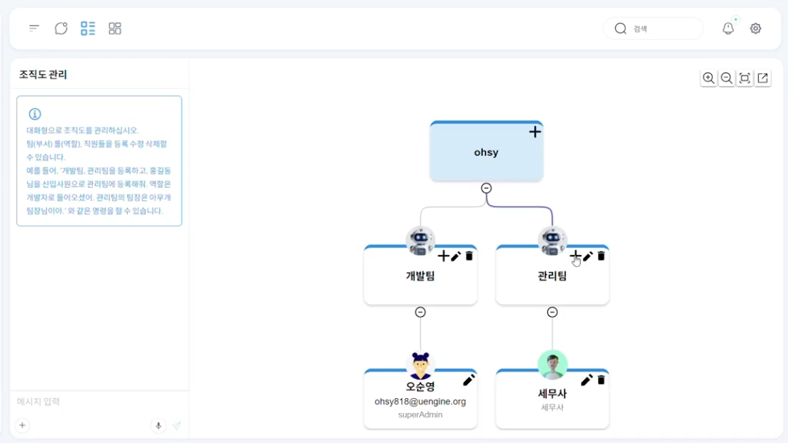
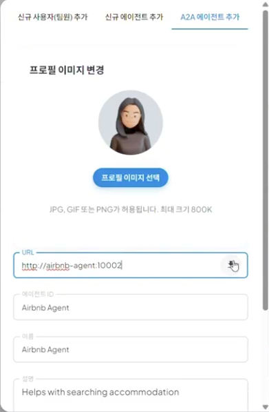
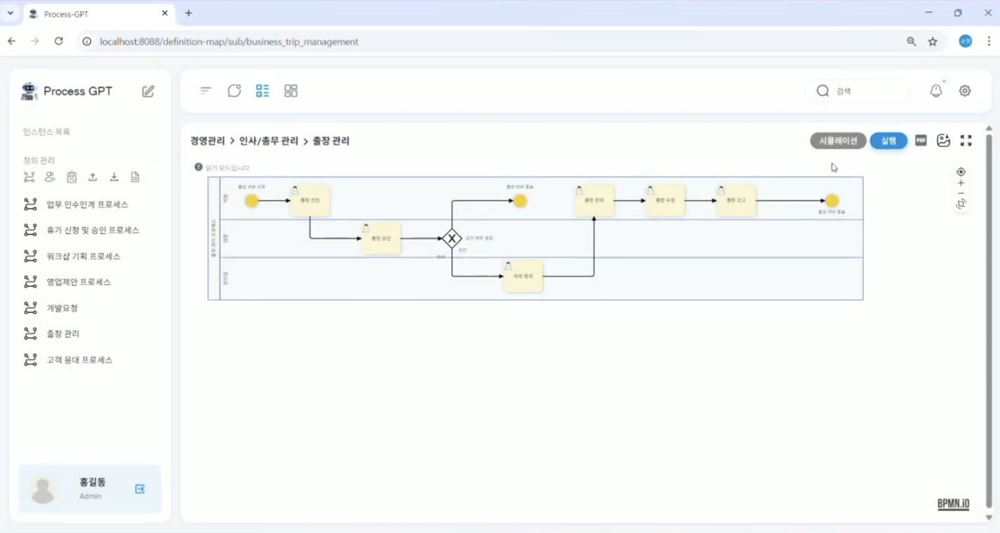
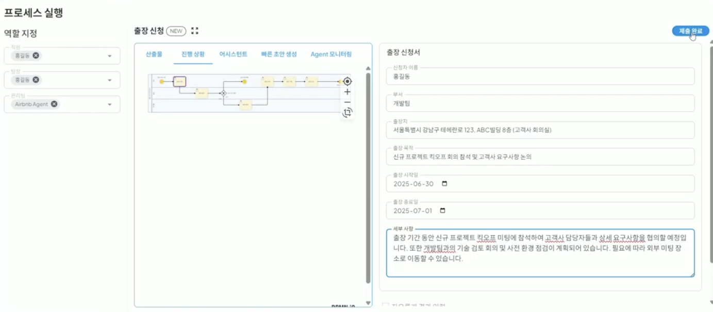
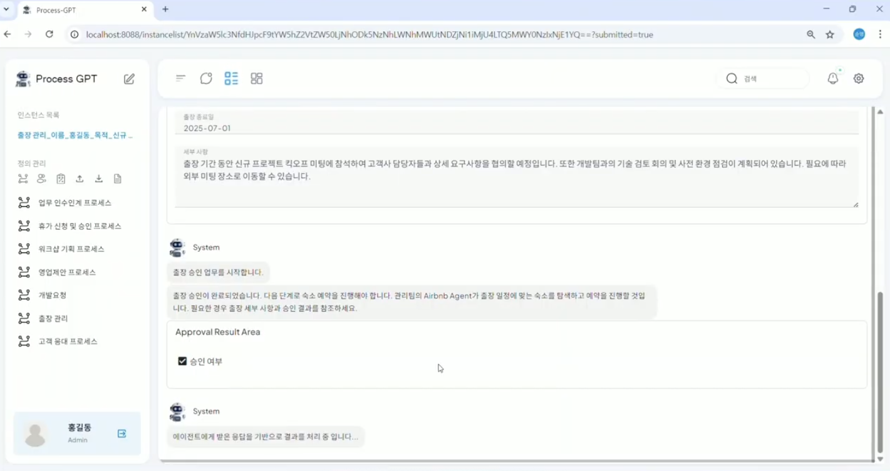
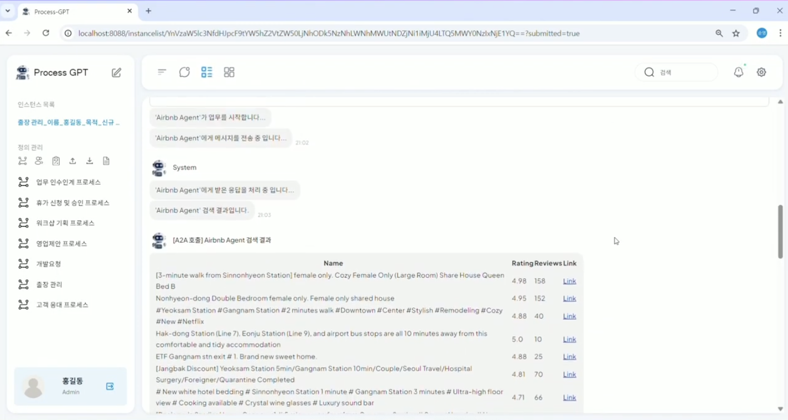
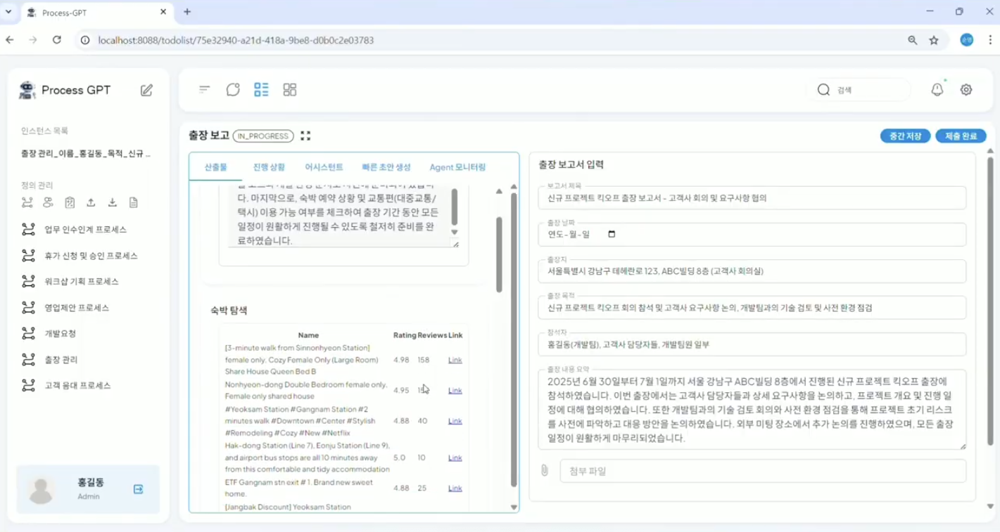

# A2A 자동화 시스템

## Agent-to-Agent 자동화 시스템

**A2A 시스템**은 이전처럼 매번 사람이 직접 "다음 단계로 진행해주세요"라고 지시하지 않아도, AI들이 하나의 팀처럼 서로 소통하며 업무를 자동으로 완성해가는 완전 자동화 시스템입니다.

내/외부 시스템들의 Discovery 및 Open API Spec을 자동으로 해석하여 프로세스 데이터 컨텍스트와의 연동 방법을 자동 생성하는 기능을 지원하여 각 시스템이 무엇을 할 수 있는지 자동으로 파악하고 최적의 연결 방법을 만들어냅니다.  
또한, 사용자의 개입 없이 워크아이템을 완료하고 프로세스 인스턴스를 진행하며, 오류 발생 시 자동으로 재시도까지 수행하여 기존 수동 업무 지시가 필요했던 프로세스들이 완전히 자동화되어 업무 효율성을 극대화할 수 있습니다.

## A2A 시스템 사용하기

에어비앤비 에이전트를 활용하여 출장신청 프로세스에 필요한 업무를 자동으로 진행하는 방법은 다음과 같습니다.

1. 정의 관리 하단에 위치한 '조직도 관리' 메뉴를 클릭하여 조직도에 진입 및 아래화면과 같이 조직도를 구성합니다.

2. 관리팀에 에어비엔비 에이전트를 구성원으로 추가하기 위해 '+' 버튼 클릭 후, 'A2A 에이전트 추가' 탭으로 이동하여 프로필 이미지 선택 후, URL에 다음의 에어비앤비 에이전트 서버를 추가 후, 아래화면과 같이 '다운로드'버튼을 클릭하여 에어비엔비 에이전트를 추가합니다.

3. 이후 프로세스 정의 체계도 > 실행할 프로세스를 클릭한 후, '실행' 버튼을 클릭합니다.

4. 실행된 화면에서 역할 지정에 아래 화면과 같이 관리팀에 생성한 Airbnb Agent를 Role로 지정하면 출장신청 task에 대한 내용을 자동으로 생성합니다.

5. 생성된 결과를 상황에 맞게 추가 수정 후, '제출 완료'를 클릭하면 이후 프로세스에 대하여 아래와 같이 에이전트가 자동으로 실행됩니다.

6. 이후, 에어비앤비 에이전트으의 특성에 맞게 출장지에 따른 적합한 숙소 예약후보를 리스트업합니다.

7. 동일한 과정으로 마지막 task인 출장 보고까지 A2A 시스템을 통해 사용자가 직접 각 task에 대한 내용을 입력할 필요없이 자동으로 생성 및 실행을 진행하여 편의성과 업무 효율성을 증대시킬 수 있습니다.

