# 프로세스 컨설팅 AI 및 관리

## 프로세스 컨설팅 AI

1. **프로세스 컨설팅 AI 화면**
   - 프로세스 컨설팅 AI 는 프로세스 정의 체계도에서 ***프로세스 컨설팅 시작하기*** 버튼을 클릭하여 사용 가능합니다.
   - **[이미지-11]**: 프로세스 컨설팅 시작하기 버튼
   

   - 프로세스 컨설팅 AI 채팅 화면에 접속합니다.
   - **[이미지-12]**: 프로세스 컨설팅 AI 채팅 화면
   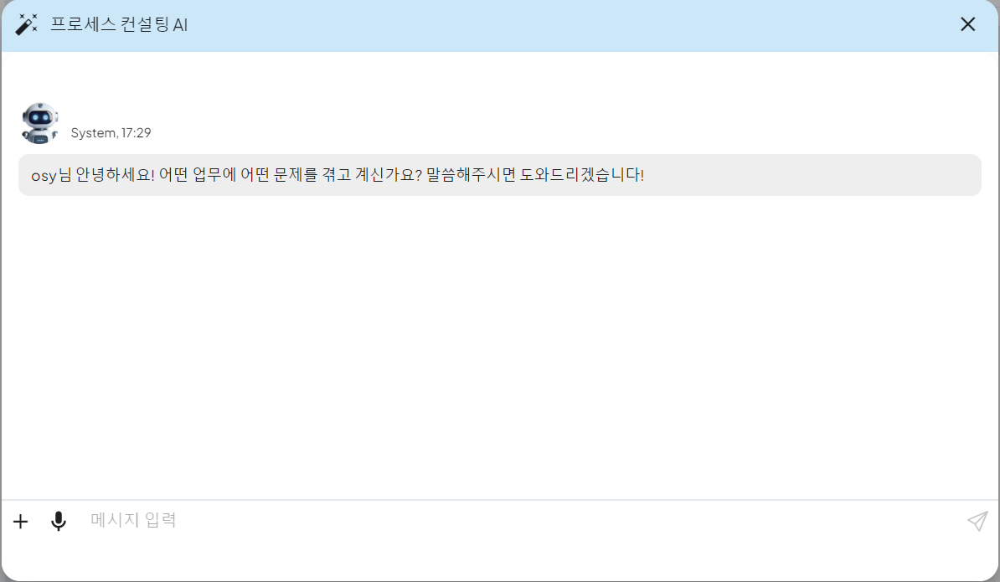

 

2. **프로세스 컨설팅 AI 생성**  
   - 채팅창을 통해 원하는 비지니스 프로세스 내용을 입력합니다.
   - 개선하거나 추가하고 싶은 내용이 있는 경우 더 자세한 내용을 입력합니다.
   - 더 이상 반영할 내용이 없는 경우 입력한 채팅 내용을 바탕으로 비지니스 프로세스 정의에 따라 다이어그램이 생성됩니다.

   - **[이미지-13]**: 프로세스 컨설팅 AI 채팅 화면
   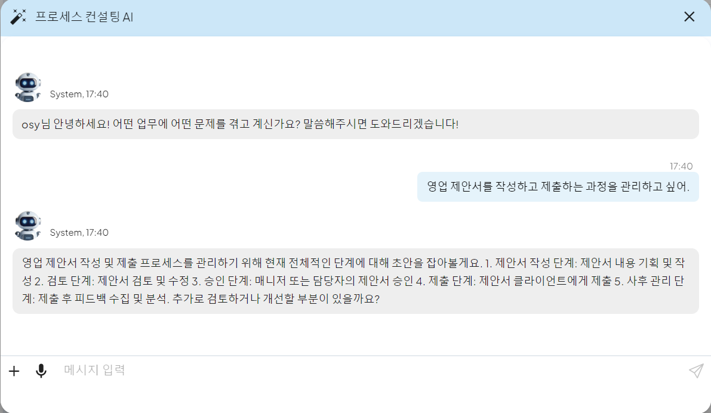

   - **[이미지-14]**: 생성된 비지니스 프로세스 BPMN 다이어그램
   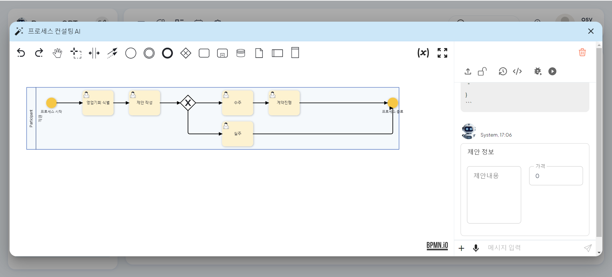

 

3. **프로세스 컨설팅 AI 저장**  
   - 생성된 다이어그램을 저장하고 싶은 경우 우측 채팅 화면 상단의 해제된 자물쇠 버튼을 클릭하여 저장합니다.
   - **[이미지-15]**: 해제된 자물쇠 버튼
   
      

   - **[이미지-16]**: 프로세스 저장 화면
   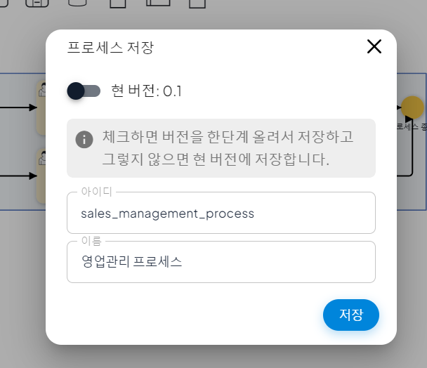

   - 저장된 비지니스 프로세스 정의는 프로세스 정의 체계도에서 확인할 수 있습니다.
   - **[이미지-17]**: 프로세스 정의 체계도
   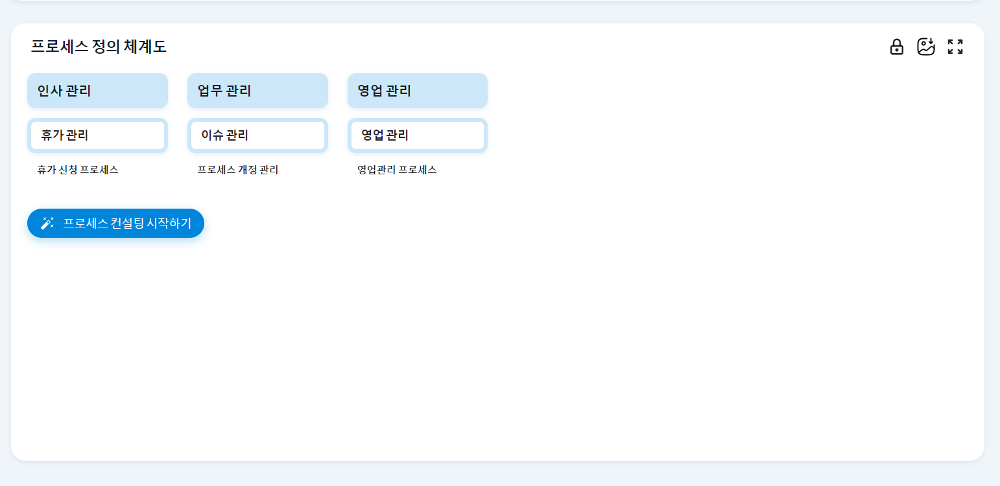
   - **[이미지-18]**:   저장된 비지니스 프로세스 정의
   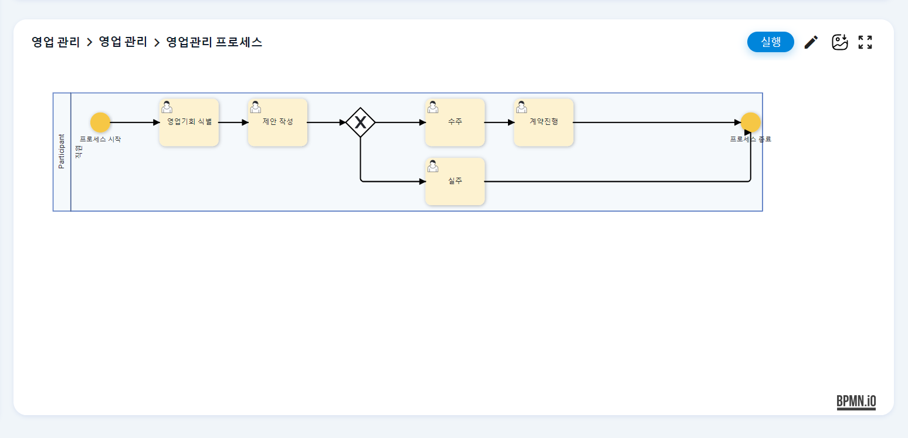

    

## 프로세스 정의 및 폼 생성

1. **프로세스 정의 화면**  
   - 프로세스 정의는 좌측 프로세스 모델링 편집 화면과 우측 프로세스 정의 채팅 화면을 통해 관리합니다.

   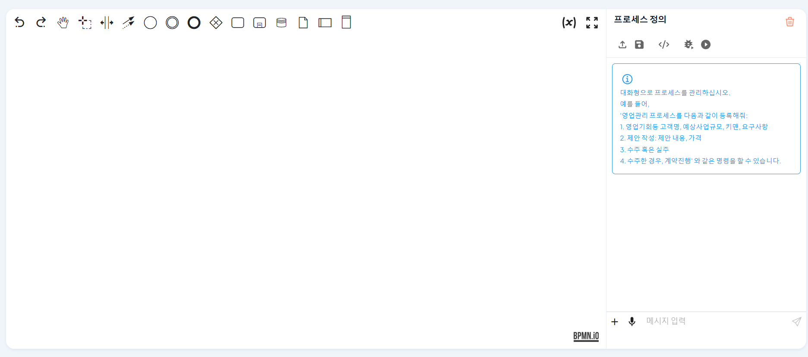

 

2. **프로세스 정의 생성**  
   - 채팅에 생성하고자 하는 프로세스 정의를 입력합니다.
   - **[이미지-1]**: 프로세스 정의 채팅
   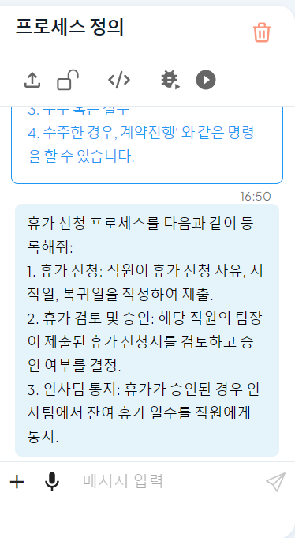

   - 사용자의 입력을 분석한 AI 가 프로세스를 정의하고 BPMN 다이어그램으로 자동 생성합니다.
   - **[이미지-2]**: 생성된 프로세스스 BPMN 다이어그램
   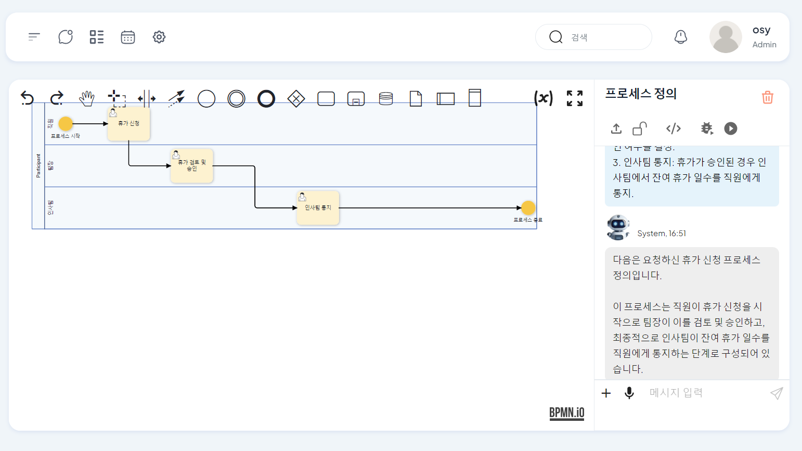

 

3. **사용자 업무 폼 생성**  
   - 각 단계별 업무에 따라 폼이 필요한 경우 AI 가 폼을 자동 생성합니다.
   - **[이미지-3]**: 사용자 업무 폼 생성
   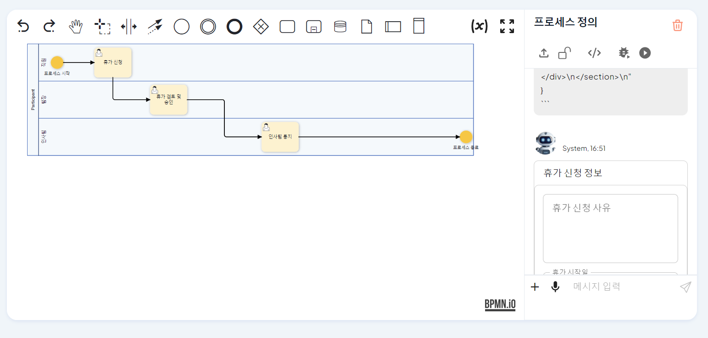

   - 생성된 폼은 업무 패널에서 확인 가능하고 직접 폼을 수정하거나 채팅을 통해 수정할 수 있습니다.
   - **[이미지-4]**: 사용자 업무 폼 수정
   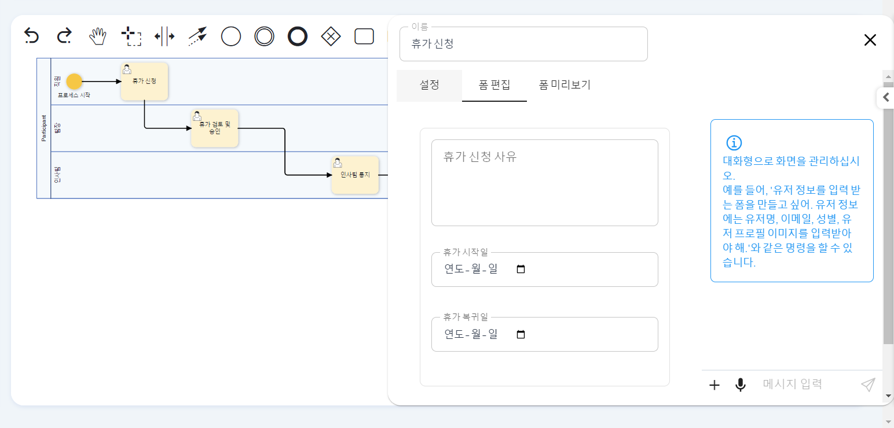

 

&nbsp;
  

4. **스크립트 업무 코드 생성**  
   - 코드 실행이 필요한 스크립트 업무가 있는 경우 업무 패널에서 실행할 스크립트 입력이 가능합니다.
   - **[이미지-5]**: 스크립트 업무 패널
   

   - 사용자는 파이썬 코드를 직접 입력할 수도 있고 프롬프트를 입력하고 스크립트 생성 버튼을 클릭하여 코드를 자동 생성할 수 있습니다.
   - **[이미지-6]**: 스크립트 업무 코드 생성
   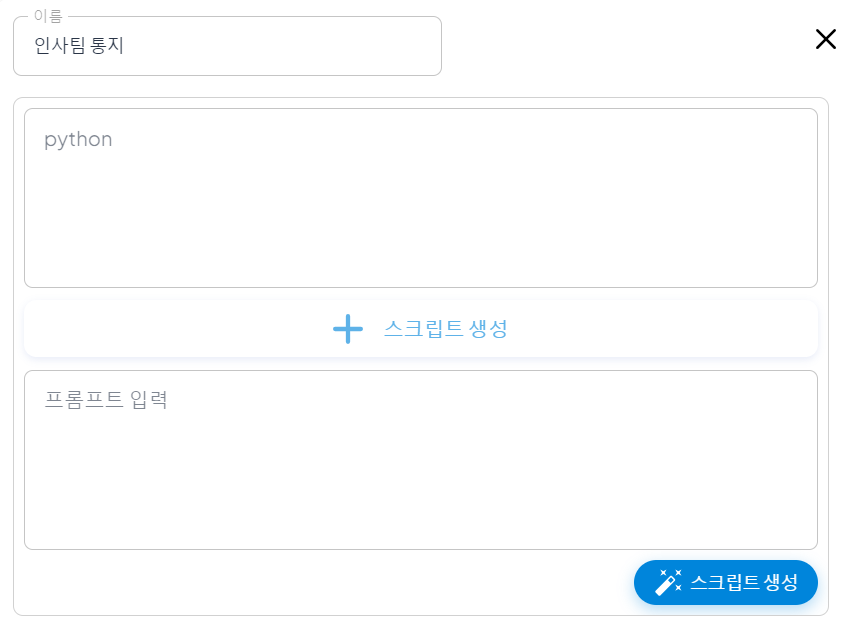

   - 생성된 코드는 스크립트 입력란에서 확인할 수 있습니다.
   - **[이미지-7]**: 생성된 스크립트 코드
   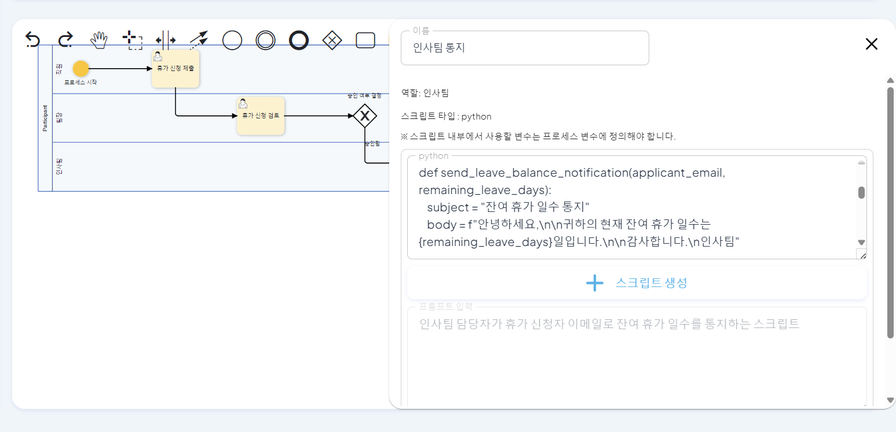

 

## 조직도 생성

1. **조직도 정의 화면**
   - 조직도 정의는 좌측 채팅 화면과 우측 조직도 차트를 통해 관리합니다.

   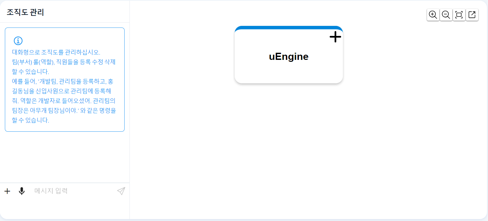

 

2. **조직도 생성**  
   - 채팅을 통해 조직도로 등록하고자 하는 팀 정보와 직원 정보를 입력합니다.
      - 추가하려는 직원이 신규 입사자인 경우 입사자 정보를 입력합니다.
      - 입력받은 이메일 주소를 통해 신규 입사자는 자동 회원가입 처리됩니다.
   - 생성된 조직도 차트에서 팀 정보와 직원 정보를 확인할 수 있습니다.
   - **[이미지-8]**: 생성된 조직도 차트
   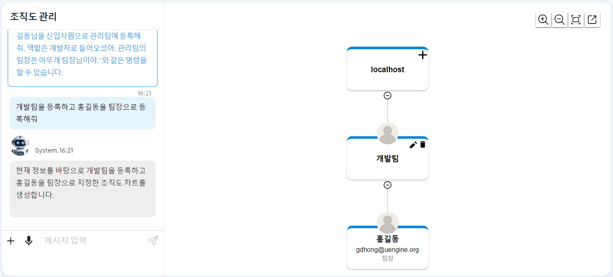

 

3. **조직도 차트 수정**  
   - 사용자는 직접 조직도 차트를 수정하고 관리할 수 있습니다.
   - 팀을 추가하고 싶은 경우 가장 상위의 회사명 요소 옆 + 버튼을 클릭합니다.
   - **[이미지-9]**: 가장 상위의 회사명 요소
   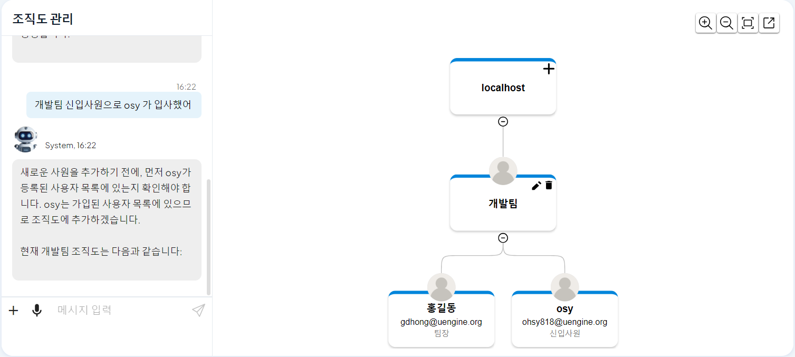

   - 팀을 삭제하고 싶은 경우 삭제하고자 하는 팀의 삭제 버튼을 클릭합니다.
   - 팀명을 변경하거나 팀원을 수정하고자 하는 경우 수정하고자 하는 팀의 수정 버튼을 클릭합니다.
   - **[이미지-10]**: 팀 수정, 삭제 버튼
   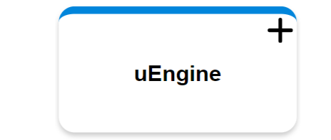

 

