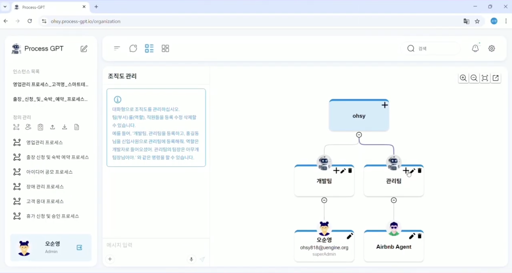
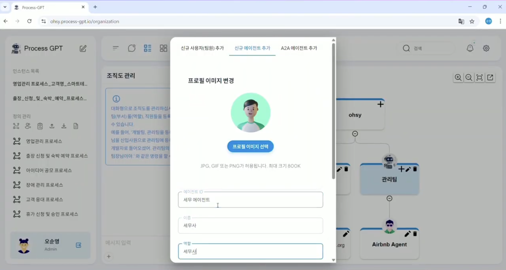
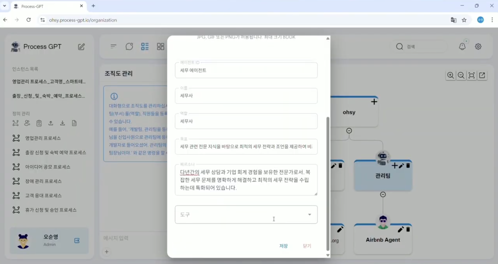
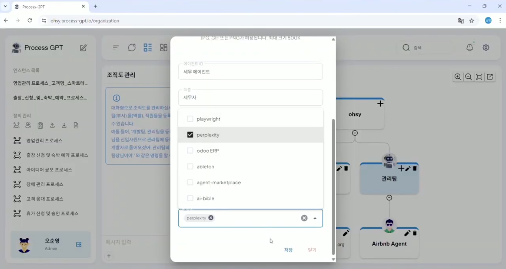
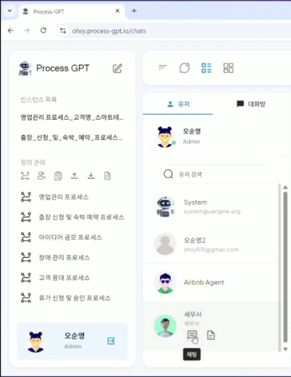
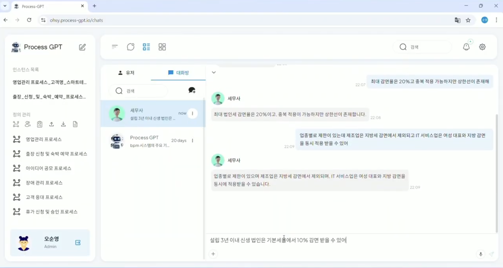
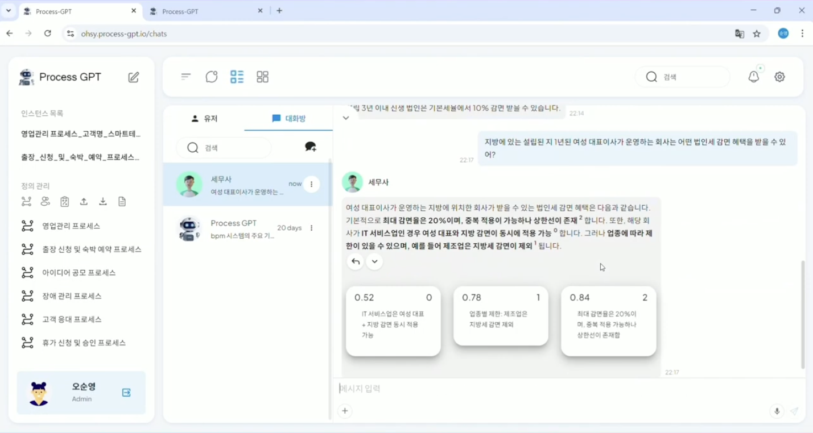

# 에이전트 지식관리

## Agent Boss 기반 에이전트 지식 훈련

에이전트 지식관리는 AI 에이전트들이 회사 고유의 업무 방식을 학습하여 업무 전반에 지원 가능하도록 하는 **"학습하고 성장하는"** 시스템입니다.

Agent Boss가 각 에이전트에 설정된 페르소나, 스킬, 도구(MCP)를 통해 체계적으로 지식을 전수하고, Mem0의 개인화 메모리 시스템을 활용해 각 사용자별 고유한 업무 스타일과 선호도를 학습하여 사용자가 질의할 때마다 맞춤형 지식을 바탕으로 최적화된 응답을 생성합니다.  
또한, 모든 학습 내용이 Neo4j 지식 그래프로 체계적으로 저장되어 편집 가능하며, 에이전트가 맥락을 이해하며 업무를 수행하여 신규 에이전트의 업무 적응 시간을 단축하고 업무 처리 정확도를 지속적으로 향상시켜 일관성 있고 향상된 품질의 결과를 도출할 수 있습니다.

## 사용 방법

에이전트 지식 훈련을 통해 세무사 Agent에게 세율 감면혜택에 대한 내용을 학습시키는 방법은 다음과 같습니다.

정의 관리 하단에 위치한 '조직도 관리' 메뉴를 클릭하여 조직도에 진입 및 아래화면과 같이 조직도를 구성합니다. 

관리팀에 '+' 버튼을 클릭하여 조직원 추가를 진행하며, 이때 '신규 에이전트 추가' 탭으로 이동하여 아래 화면과 같이 다음의 항목에 수정합니다. 

 

| 항목 | 내용 |
|------|------|
| 프로필 이미지 선택 | 자유 |
| 에이전트 ID | <에이전트의 업무내용> 에이전트 |
| 이름 | <에이전트의 직업> |
| 역할 | <에이전트의 직업> |

 

| 항목 | 내용 |
|------|------|
| 목표 | <에이전트 활용에 대한 목표> |
| 페르소나 | <에이전트의 페르소나> |

 
| 항목 | 내용 |
|------|------|
| 도구 | <에이전트가 활용할 도구(MCP)> |

생성이 완료되면 상단 메뉴 '채팅' > '유저'를 클릭하여 이전 단계에서 생성한 에이전트가 채팅목록에 표시되며, 아래 화면과 같이 '채팅'을 클릭하여 대화화면을 생성합니다. 

채팅화면에서 세무사 Agent에게 아래와 같이 회사와 관련된 지식을 주입하여 훈련을 진행하면 아래와 같이 세무사 Agent가 사용자의 대화내용을 기반으로 사내 지식을 학습합니다. 

이후, 에이전트에게 훈련 시킨 내용을 기반으로 사내 관련 질문을 하면 Agent가 학습한 내용을 기반으로 관련된 최적의 답변을 제공합니다. 

이를 통해 특정 업무에 필요한 사전 지식을 Agent에게 학습하여 지식을 축적시키고 필요한 상황에 질문하여 업무의 효율성을 증대시킬 수 있습니다.