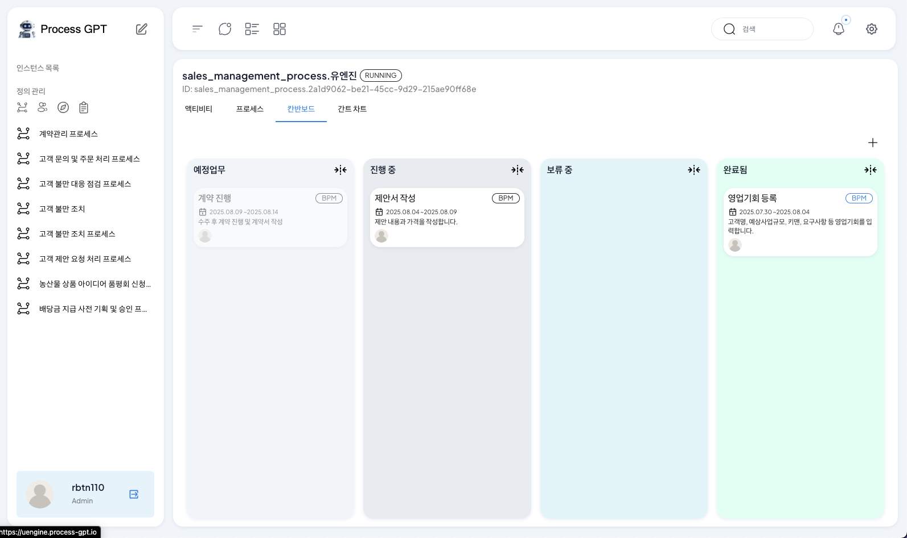
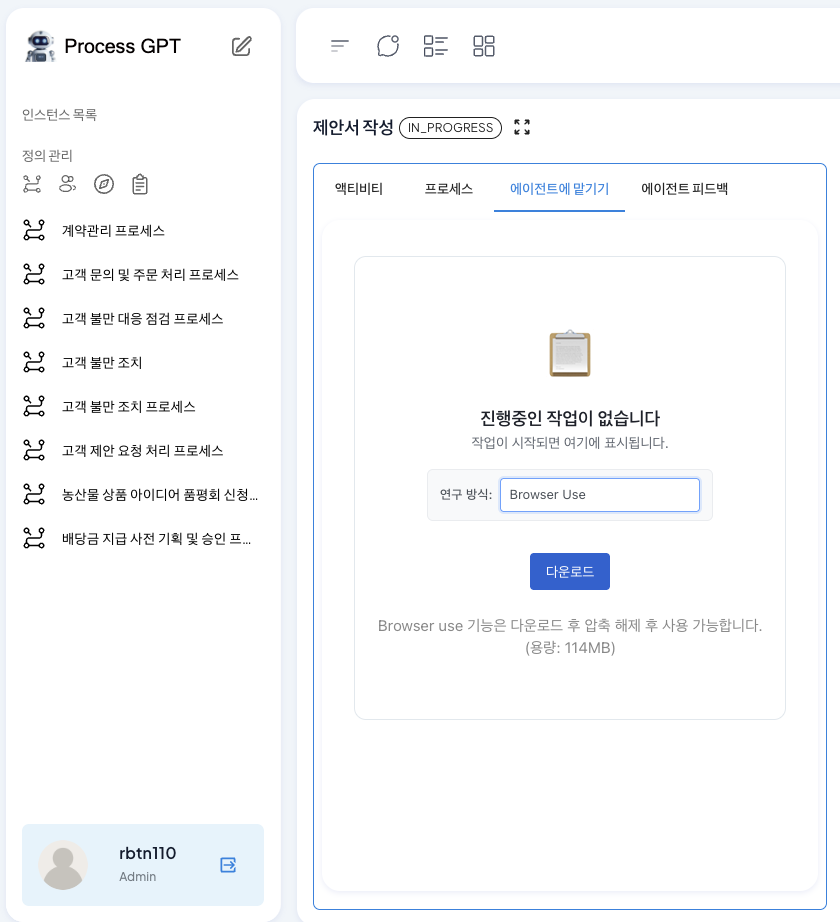
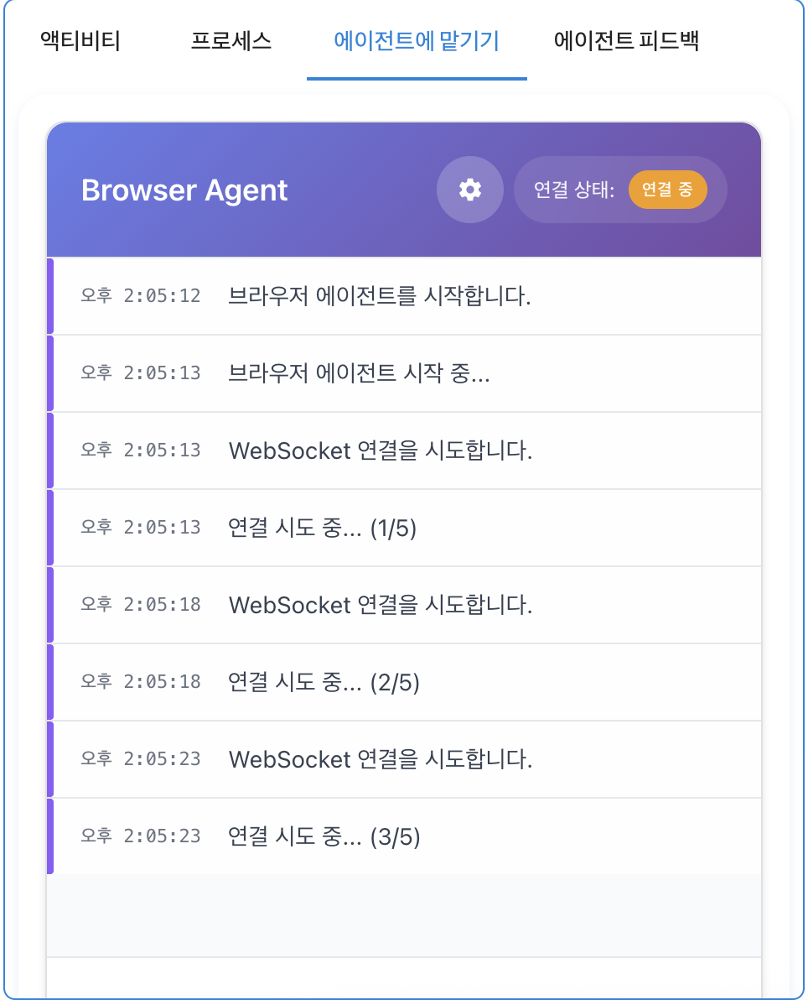
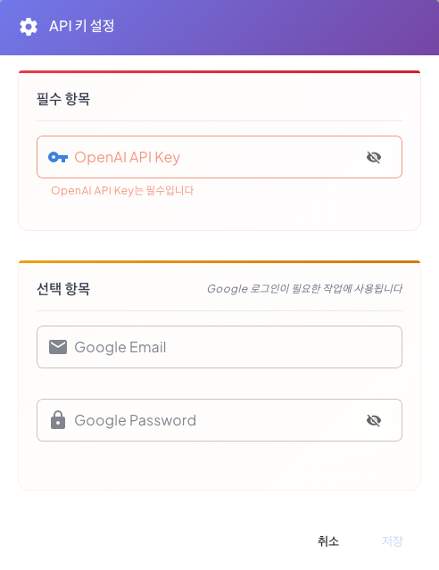
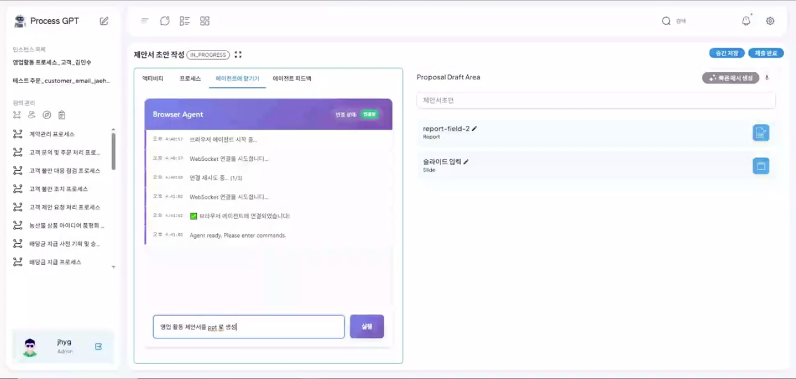
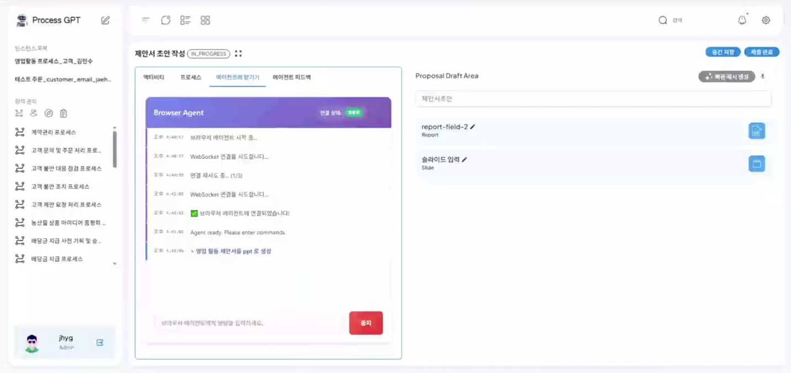
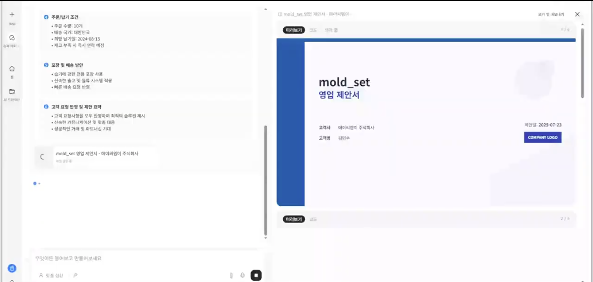

# Browser Use 에이전트

## Browser Use 에이전트를 활용한 웹 도구 연동
Browser Use 에이전트 시스템은 프로세스의 Task를 처리하는데 있어 필요한 웹 기반 업무를 자동으로 감지하고 처리하는 기응입니다.

제안서 작업에 필요한 PPT제작에 있어 AI 기반 PPT 제작 도구 GenSpark나 검색 사이트 Google 등 Browser Use를 통해 웹 기반 도구에 접근하여 프로세스에 적합한 업무를 처리할 수 있습니다.

### Browser Use 에이전트 사용하기
Browser Use 에이전트를 활용하여 영업제안 프로세스를 웹기반 젠스파크 도구를 활용하여 PPT 생성하는 방법은 다음과 같습니다.

영업제안 프로세스를 실행하여 제안서 작성단계까지 프로세스를 진행한 후, 제안서 작성을 클릭합니다 
 

이후, '에이전트에 맡기기'를 클릭한 다음 연구방식에서 Browser Use를 선택합니다. 최초 선택시 로컬에 Browser Use를 설치하는 단계가 진행되며 '다운로드'를 클릭하여 설치를 진행합니다. 
 

설치가 완료되면 시작하기를 진행합니다. 이후 아래 화면과 같이 설치된 Browser Use 연결 시도가 진행됩니다. 
 

연결이 시도될 때, 상단 톱니바퀴 아이콘을 클릭하여 API Key설정과 웹사이트에 사용되는 Google 로그인을 진행하기 위한 Google 계정 정보를 입력합니다. 
 

연결이 완료되면 현재 Task에서 필요한 영업활동 제안서를 PPT로 작성하기 위해 AI가 자동으로 프롬프트를 추가합니다. 이 프롬프트에는 사용자가 추가적인 요구사항을 추가할 수 있으며 요구 사항이 구체화될수록 Browser Use의 동작이 정확하게 이루어집니다. 
 

프롬프트 기반 생성을 요청하면 아래와 같이 생성 요청에 대한 진행이 이루어지는 것을 확인할 수 있으며, 요구사항에 적합한 웹 도구 탐색 및 실행이 진행됩니다. 
 

이후 AI기반 PPT 생성 도구인 Genspark에 접속하여 입력한 요구사항을 정제하여 PPT 생성을 요청하며, 아래와 같이 생성을 진행합니다.
 

PPT 생성 완료와 같이 Browser Use가 요청한 Web 요청이 완료되면 아래와 같이 요청에 대한 진행이 완료되었음을 확인할 수 있습니다.
 

이처럼 Browser Use 에이전트는 프로세스의 요구사항을 파악하여 웹 도구와의 연결을 통해 업무를 진행함으로써 업무 처리의 효율을 향상시킬 수 있습니다.