# 멀티 에이전트

## MCP를 탑재한 멀티 에이전트 자동 초안 생성

멀티 에이전트는 MCP(Model Context Protocol) 통합 멀티에이전트를 통한 프로세스 자동화로, 복잡한 업무를 단계별로 분석하고 최적의 솔루션을 자율적으로 구현하는 시스템입니다.

업무 요구사항에 따라 전문화된 AI 에이전트들이 자동으로 팀을 구성하여 각자의 전문 분야에서 프로젝트를 수행하며, 각 에이전트가 독립적으로 목표를 달성하기 위해, 에이전트 간 위임과 질의를 통해 유연한 프로세스를 수행을 통한 자율적으로 문제를 해결합니다.  
또한, MCP를 통해 내부 문서 검색, Office 도구, 데이터베이스, 클라우드 서비스 등 수백 가지 업무 도구가 하나의 인터페이스로 연결되어 에이전트들이 실제 직원처럼 회사의 모든 시스템에 접근하여 CRM 분석부터 보고서 작성, 일정 관리, 부서 협업까지 자동으로 처리하여 기존 수주일 걸리던 업무를 수시간 내로 단축하고 에이전트들의 다양한 도구활용을 통해 전문성을 보장합니다.

## 멀티 에이전트 초안 생성하기

멀티 에이전트를 활용하여 영업관리 프로세스의 제안서 초안을 생성하는 방법은 다음과 같습니다.

1. 프로세스 정의 체계도에 등록된 프로세스를 클릭한 후, 아래와 같은 화면에서 '실행'을 클릭합니다.

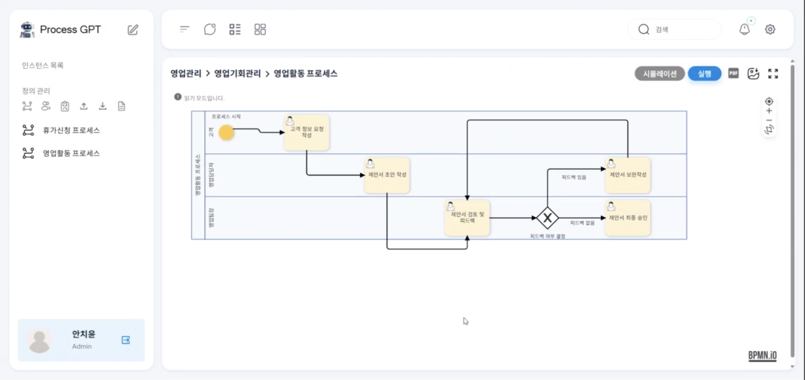

2. 이후, 상단 항목에서 '빠른 초안 생성'을 클릭하여 고객 정보 요청 작성 task를 생성 후, '제출 완료'를 클릭합니다.

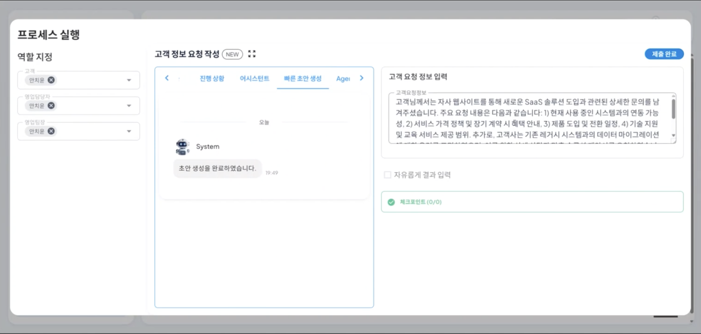

3.제출이 완료되면 진행상황에서 고객 정보 요청 작성 task가 완료된 것을 확인함과 동시에 제안서 초안 작성 task가 현재 진행상태로 표시된 것을 확인할 수 있습니다.

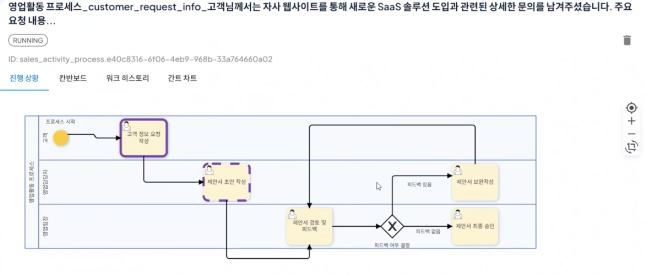

4.이후 '칸반보드'를 클릭하여 영업관리 프로세스의 전체 task중 진행 중인 task 제안서 초안 작성을 클릭합니다.

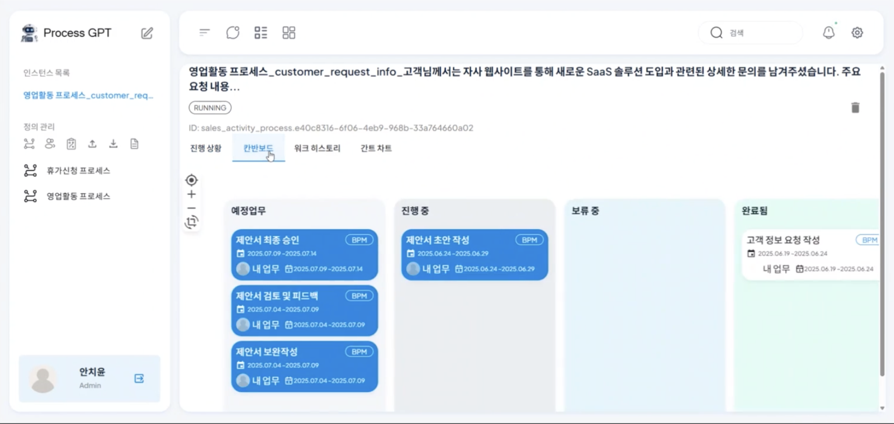

5. 제안서 초안 작성 task 에서 Agent 모니터링을 클릭하면 영업관리 프로세스의 요구사항에 따른 전문화된 AI 에이전트들이 각자 필요한 제안서 초안 작성을 시작합니다.

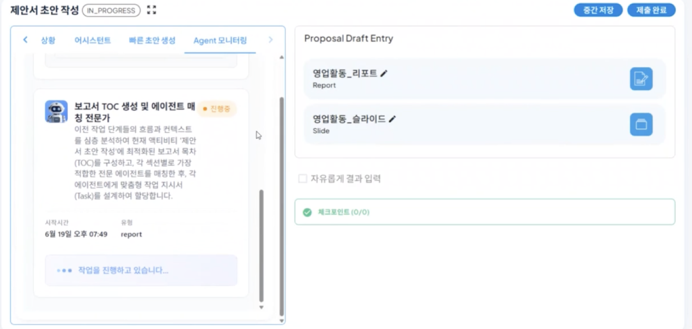

6. 에이전트에 의해 작성된 영업활동 리포트에 대한 초안중 하나를 '채택'을 클릭하여 등록하면 아래와 같이 Proposal Draft Entity 항목에 채택한 리포트가 생성됩니다.

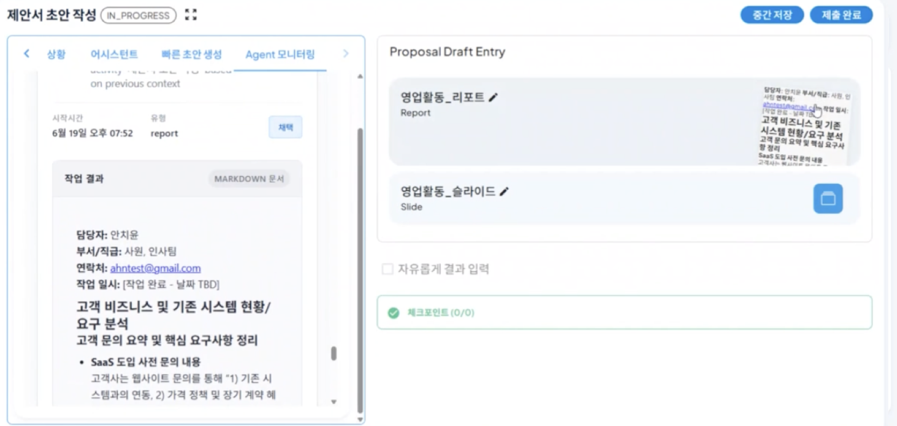

7. 해당 리포트를 클릭하면 세부적인 내용을 확인할 수 있으며, 일부 내용중 수정이 필요한 사항이나 추가해야될 사항에 대하여 작업을 진행할 수 있습니다.

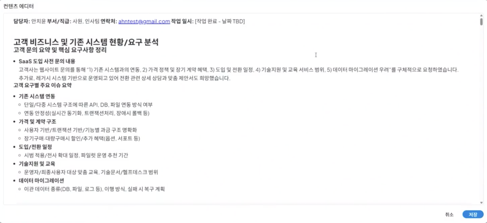

8. 특정 내용에 대하여 Drag를 진행하면 아래와 같이 Drag한 영역에 대하여 요구사항을 입력하고 생성 및 수정을 진행할 수 있습니다.

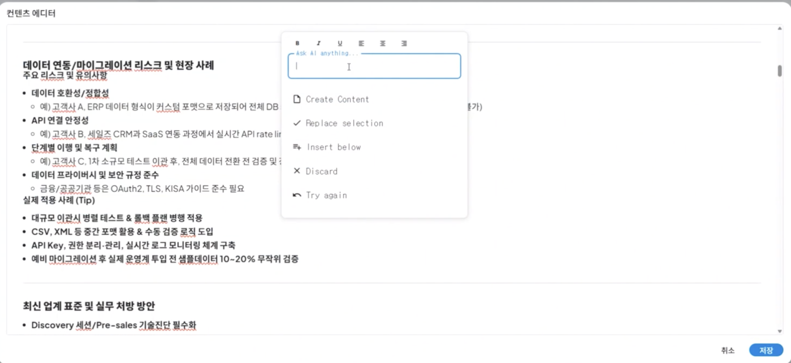

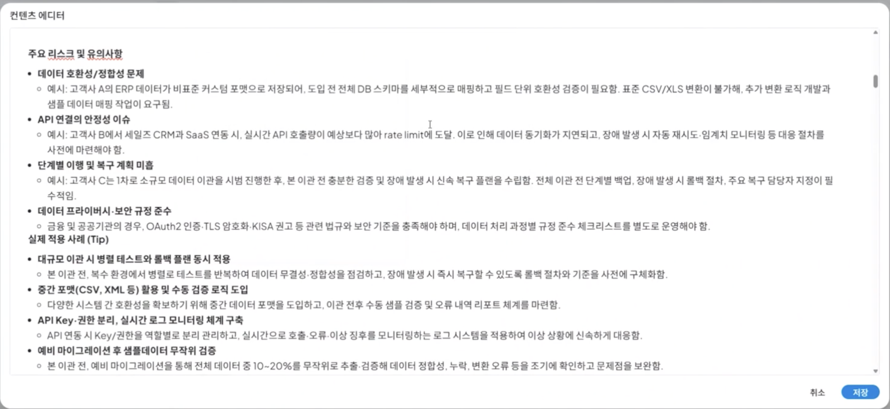

**<요구사항에 따른 리포트 수정 결과>**

동일한 방식으로 아래와 같이 '영업활동_슬라이드'에 대하여 선택한 후, '제출완료'를 클릭하여 제안서 초안 작성 task를 마무리합니다.
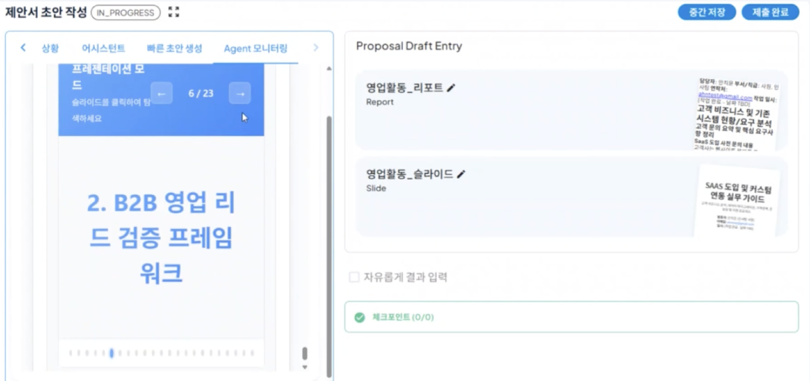

이후, 다시 진행 상황을 확인하면 진행 중이던 제안서 초안 작성 task가 AI 에이전트가 생성해준 제안서를 기반으로 완료된 것을 확인할 수 있습니다.
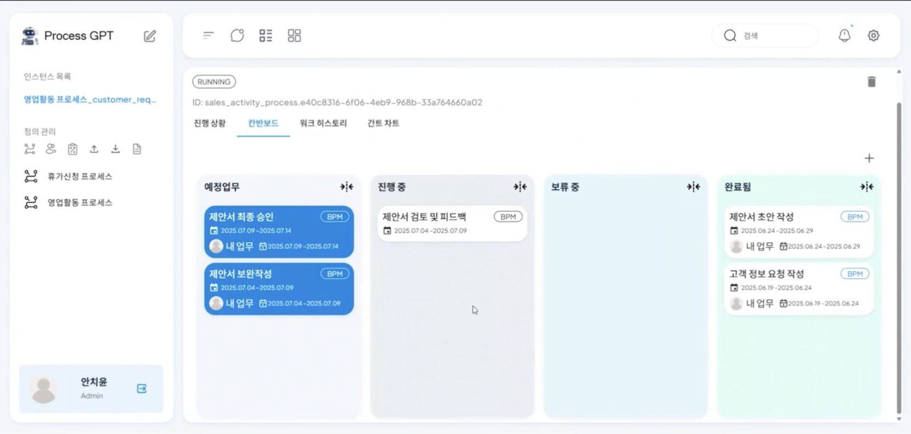