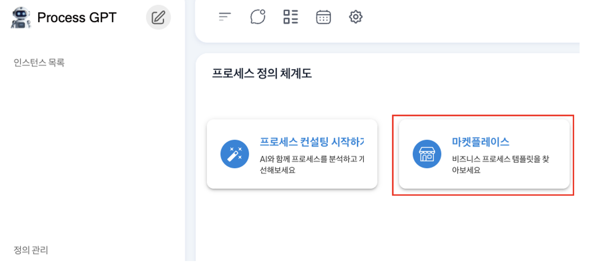
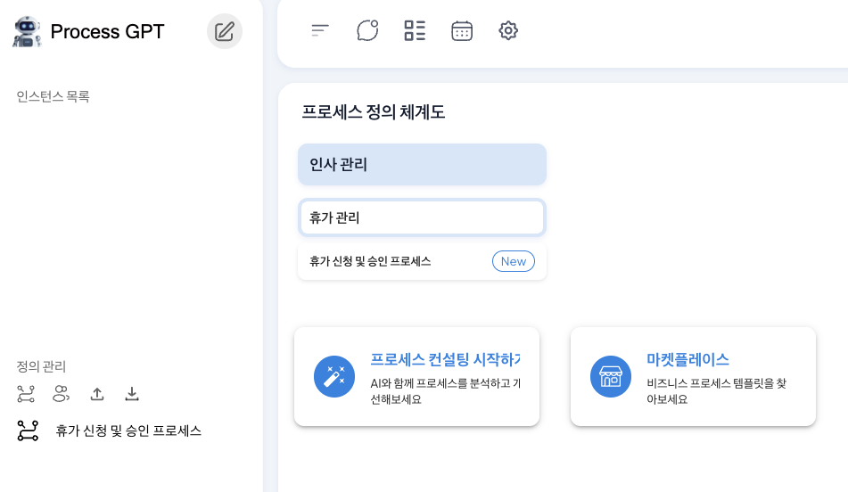
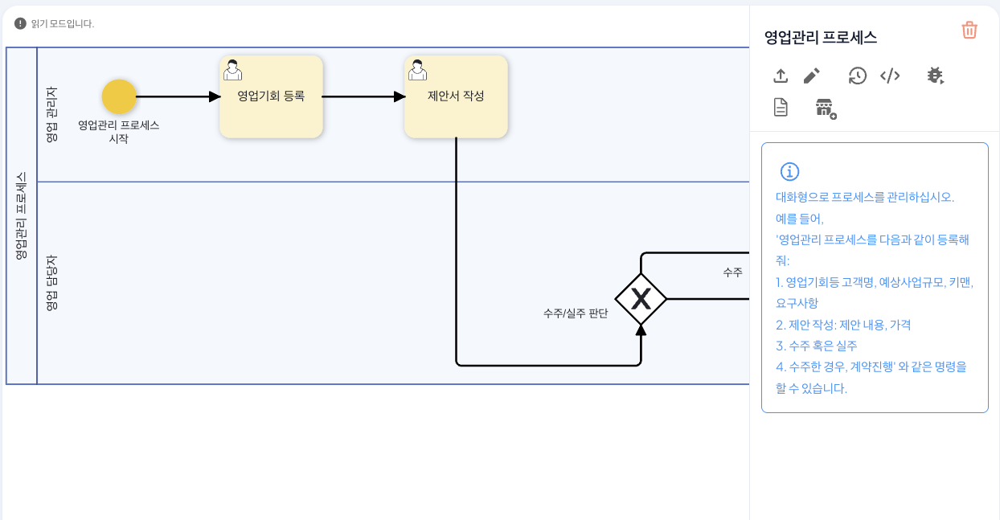
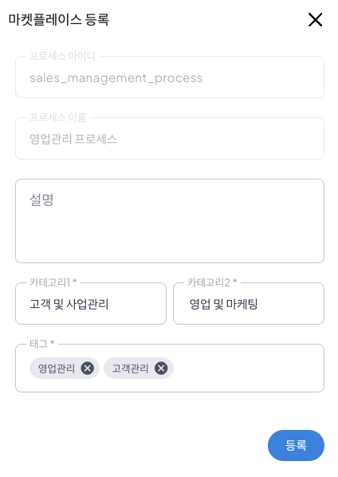
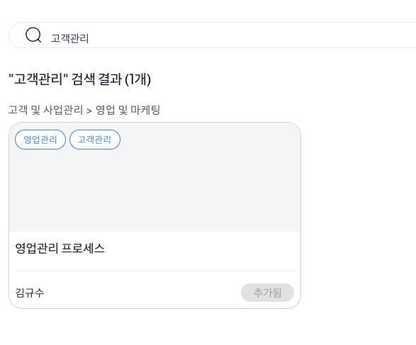

# 마켓플레이스

## 프로세스 마켓플레이스

프로세스 마켓플레이스는 기존의 새로운 업무 프로세스를 구축할 때마다 처음부터 설계해야 하는 부담과 효과적인   프로세스를 찾기까지 많은 시간을 투자해야하는 문제를 해결하기 위한 도구입니다.

프로세스 마켓플레이스를 통해 다양한 업무 영역의 검증된 프로세스 템플릿을 검색하고 추가하여 즉시 활용할 수 있으며, 자신이 설계한 프로세스를 다른 사용자와 공유할 수도 있습니다.   
이를 통해 **프로세스 설계 시간을 단축**하고, 모범 사례를 빠르게 도입 및 수정할 수 있어 **프로세스 구축의 효율성과 품질을 동시에 향상**시킬 수 있습니다.

## 마켓플레이스 적용

마켓플레이스를 통해 휴가 신청 및 승인 프로세스를 적용하는 방법은 다음과 같습니다.

1. 프로세스 정의 체계도에 진입하여 '마켓플레이스'를 클릭하여 실행합니다.

2. 마켓플레이스가 실행되면 아래와 같이 검색창에 '휴가 신청 및 승인 프로세스'를 입력하여 마켓플레이스에 등록된 프로세스를 검색 후, 추가를 진행합니다.

3. 추가가 완료되면 프로세스 정의 체계도에 해당 프로세스를 마켓플레이스에 등록할 때 입력한 Mega, Major 프로세스와 함께 아래와 같이 휴가 신청 프로세스가 생성되어 사용할 수 있습니다.

## 마켓플레이스 등록

마켓플레이스는 사용자가 설계한 프로세스를 등록하여 다른 사용자와 공유할 수 있습니다.

영업관리 프로세스를 활용하여 마켓플레이스에 등록하는 방법은 다음과 같습니다.

1. 생성한 프로세스 정의 화면 우측 영업관리 프로세스 하단에 '마켓플레이스 등록'을 클릭하여 마켓플레이스 등록을 진행합니다.

2. 마켓플레이스 등록창이 생성되면 영업관리 프로세스를 마켓플레이스에 등록할 때 필수로 입력해야하는 정보창들이 나타나며 다음과 같은 정보를 입력해야 합니다.

| 구분 | 항목명 | 예시 입력값 |
|------|--------|--------|
| **카테고리1** | Mega Process Name | 고객 및 사업관리 |
| **카테고리2** | Major Process Name | 영업 및 마케팅 |
| **태그** | 마켓플레이스에 등록할 검색 chip | 영업관리, 고객관리 |
 

3. 표를 참고하여 아래와 같이 영업관리 프로세스를 마켓플레이스에 등록합니다. 이때, 태그는 키워드 단위로 'enter'를 입력하여 등록할 수 있습니다.

4. 등록이 완료되면 마켓플레이스에 아래와 같이 등록된 것을 확인할 수 있습니다.

