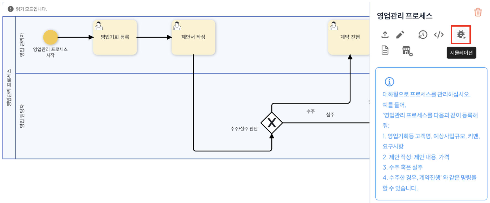
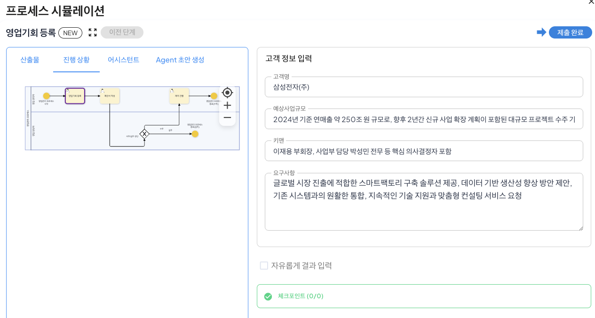
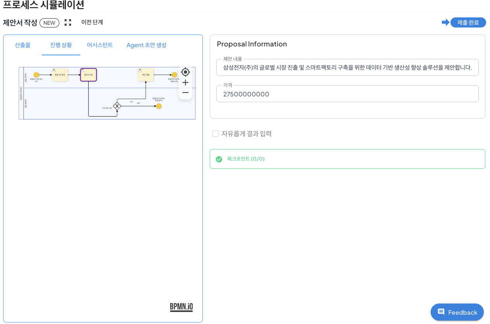
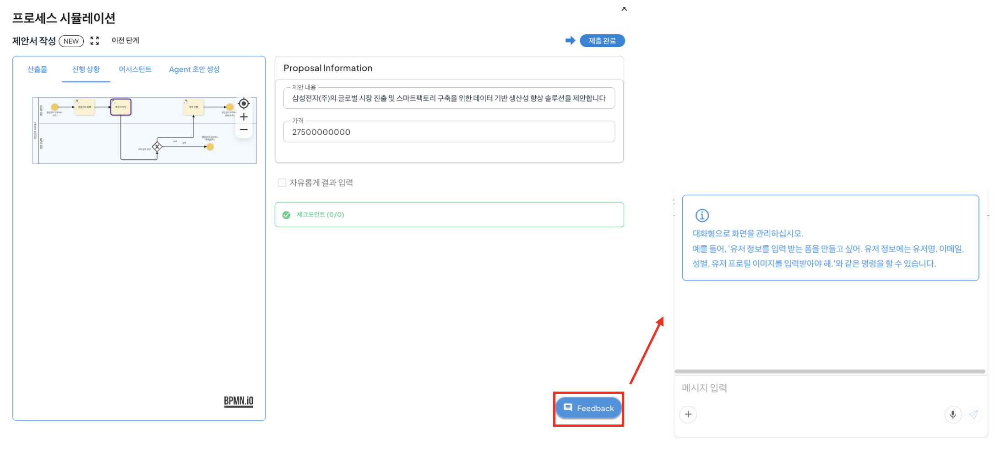
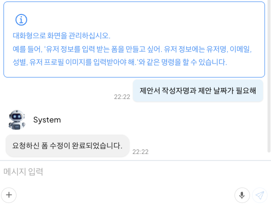
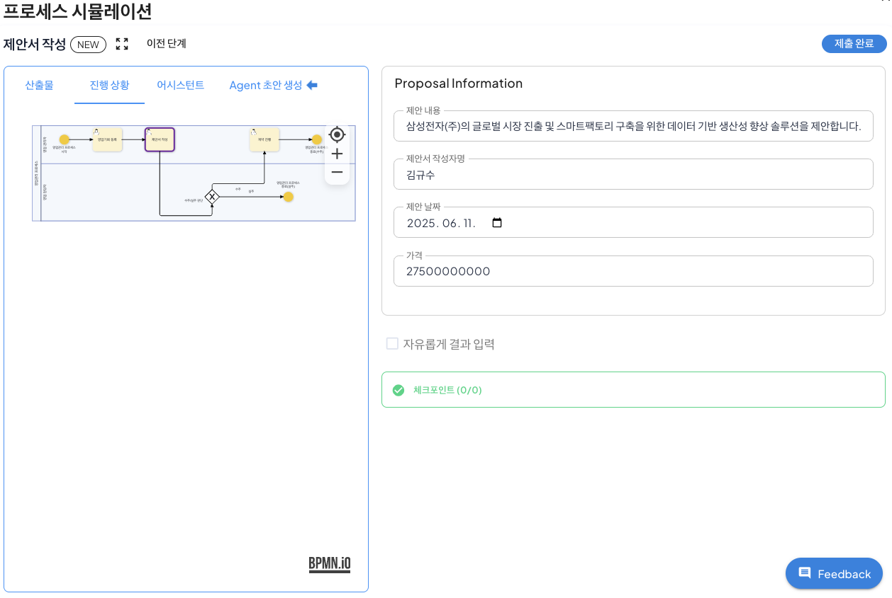

# 프로세스 시뮬레이션 & 피드백 수정

## 시뮬레이션 모드

시뮬레이션 기능은 구축이 완료된 업무 프로세스를 실행환경과 동일한 가상 환경에서 프로세스를 실행하여 단계별 발생하는 오류를 파악하고 이를 수정할 수 있도록 하는 일종의 테스트 환경을 지원하는 기능입니다.

시뮬레이션 모드에서는 실제 프로세스 실행과 동일한 환경에서 테스트가 진행되기 때문에 프로세스를 실행하지 않고도 단계별 발생하는 문제를 확인할 수 있습니다.  
또한, 시뮬레이션 데이터는 별로도 관리되기 때문이 실제 업무 데이터와 분리되어 안전하게 프로세스를 검증할 수 있기에 운영 리스크를 최소화하고 설계한 프로세스의 품질을 보장할 수 있습니다.

### 시뮬레이션 모드 실행

영업관리 프로세스를 통해 시뮬레이션 모드를 실행하는 방법은 다음과 같습니다.

프로세스 정의 화면에서 영업관리 프로세스 하단 메뉴의 '시뮬레이션'을 클릭하여 시뮬레이션 모드를 실행합니다.
 

시뮬레이션이 실행되면 아래와 같은 화면이 생성되며, Agent에 의해 시작 task에 연결한 폼에 적합한 테스트값이 입력된 것을 확인할 수 있습니다.
 

폼에 입력된 값을 확인 후, 우측 상단 '제출 완료'를 클릭하면 다음 단계가 실행됩니다. 이때, 현재 진행되는 단계에서 이상이 발생할 경우 오류가 출력되며 사용자는 출력된 오류를 통해 수정할 수 있습니다.

다음 단계가 실행되면 동일하게 Agent 초안 생성을 통해 현재 task에 적합한 결과물이 생성되며, 사용자는 제출완료를 통해 다음 단계를 진행하거나 '이전 단계'를 클릭하여 이전 task에 입력한 값을 수정할 수 있습니다.  

## 피드백 채팅

피드백 채팅은 프로세스 시뮬레이션 기능에서 현재 단계의 폼의 수정이 필요할 때 AI를 활용하여 자동으로 업무 흐름을 고려하여 조정하는 기능입니다. 

현재 진행 중인 업무 단계에서 직접 피드백을 입력하면 AI가 요구사항과 전체 흐름을 고려하여 폼에 대한 수정안을 제안 및 적용합니다. 
피드백 채팅을 통해 프로세스 개선에 필요한 시간을 최소화하고, 프로세스의 유연한 조정을 통한 업무 담당자의 요구사항 반영에 따른 업무 효율성이 크게 향상됩니다.

### 피드택 채팅을 통한 폼 수정

피드백 채팅을 통해 영업관리 프로세스의 제안서 작성 task의 폼을 편집하는 방법은 다음과 같습니다.

제안서 작성 단계에서 하단의 'Feedback'을 클릭하여 피드백을 진행할 채팅창을 활성화합니다.
 

채팅창에 아래와 같이 '제안서 작성자명과 제안 날짜가 필요해'라고 입력 후 'Enter'를 입력하여 채팅을 진행합니다.
 

채팅이 입력되면 AI가 입력된 요구사항을 바탕으로 기존 프로세스에 작성된 폼을 아래와 같이 수정을 진행합니다.
 

이를 통해 사용자는 테스트 환경에서 프로세스를 실행해보며 발생한 문제를 파악하고 각 단계별 수정이 필요한 사항에 빠른 수정을 진행하여 프로세스의 품질을 보장할 수 있습니다.