# Process-GPT 주요 기능

## AI 기반 채팅

상단의 채팅 아이콘을 통해 채팅 화면에 접속합니다.

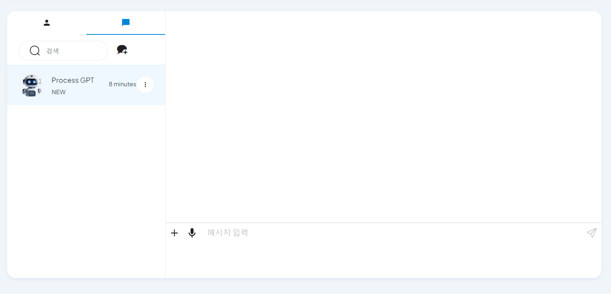

1. **일반 채팅**
   - 사용자는 채팅 중 GPT 활성화 기능을 통해 수행해야 할 업무를 추천받을 수 있습니다.

 

2. **AI 음성 채팅**
   - 채팅 화면의 하단에서 + 버튼을 클릭하고 채팅 기능 더보기에서 헤드셋 버튼을 클릭하여 음성 채팅을 시작합니다.
   - **[이미지-1]**: + 버튼
   
      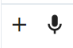
   
   - **[이미지-2]**: 헤드셋 버튼

      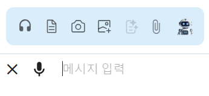

   - 음성 채팅 화면에서 사용자는 하단의 오디오 버튼을 클릭하여 프로세스에 대한 질의를 합니다.
   - **[이미지-3]**: 오디오 버튼
   
      

   - 질의가 끝나면 멈춤 버튼을 클릭하고 응답을 기다립니다.
   - **[이미지-4]**: 멈춤 버튼

      

   - AI 는 사용자의 질의를 바탕으로 프로세스에 대한 응답을 제공합니다.
   - **[이미지-5]**: 응답 중인 화면

      

   - 응답 받은 내용은 텍스트로 채팅 기록에 저장되어 확인할 수 있습니다.
   - **[이미지-6]**: 채팅 기록
   
      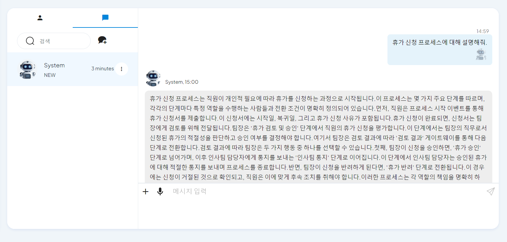

## 프로세스 인스턴스 실행

1. **프로세스 인스턴스 실행**
   - 사용자는 프로세스 정의 체계도에서 실행하고자 하는 프로세스를 선택합니다.
   - 우측 상단의 실행 버튼을 클릭하여 프로세스 인스턴스를 실행합니다.
      - 인스턴스 워크아이템을 수행할 롤을 지정할 수 있습니다.
      - 워크아이템 수행을 위한 폼을 입력할 수 있습니다.
   - **[이미지-7]**: 프로세스 인스턴스 실행 화면

      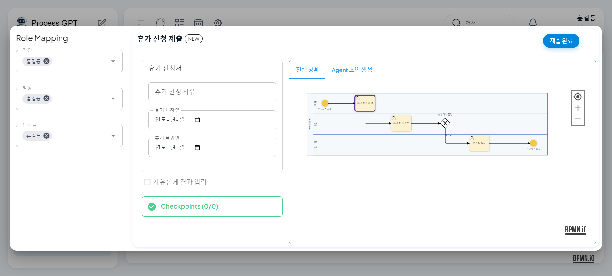

 

2. **프로세스 인스턴스 조회**
   - 사용자는 인스턴스 목록에서 현재 진행 중인 프로세스 인스턴스를 조회할 수 있습니다.
   - **[이미지-8]**: 실행 중인 프로세스 인스턴스 목록

      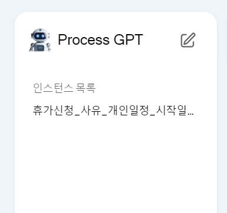

 

3. **프로세스 인스턴스 - 진행 상황**
   - 사용자는 인스턴스의 진행 상황 탭에서 현재까지의 프로세스 진행 상황을 모니터링을 할 수 있습니다.
      - 완료된 워크아이템은 실선으로 표시되고 진행 중인 워크아이템은 점선으로 표시됩니다.
   - **[이미지-9]**: 프로세스 인스턴스 진행 상황 화면

      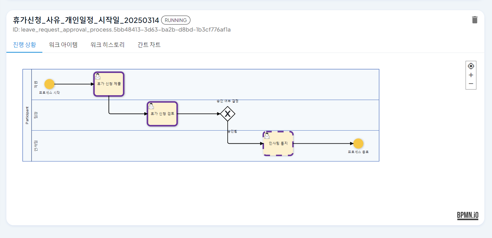

 

4. **프로세스 인스턴스 - 워크아이템**
   - 사용자는 전체 워크아이템 목록과 진행 상태를 확인할 수 있습니다.
      - 드래그 앤 드롭을 통해 워크아이템의 진행 상태를 변경할 수 있습니다.
      - 좌측 하단 + 버튼을 통해 새로운 워크아이템을 추가할 수 있습니다.
   - **[이미지-10]**: 프로세스 인스턴스 워크아이템 화면

      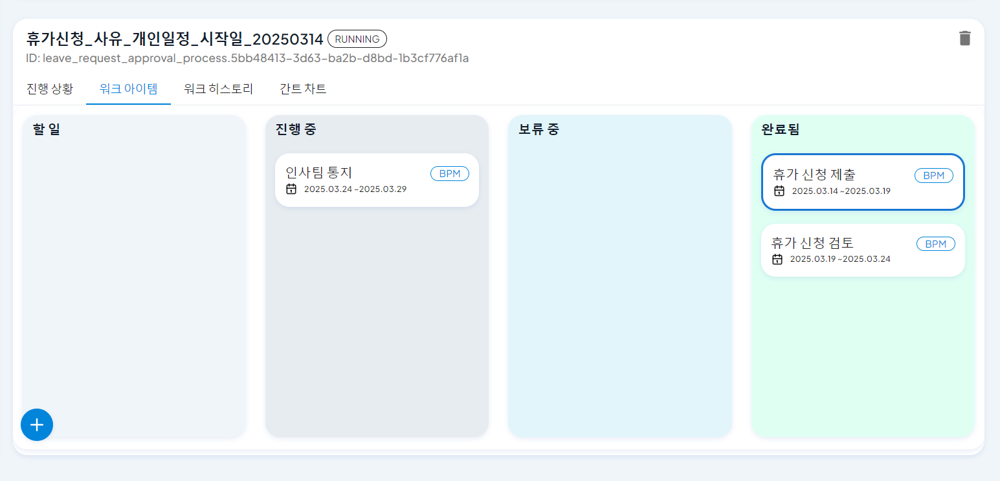

 

5. **프로세스 인스턴스 - 워크 히스토리**
   - 사용자는 대화형 히스토리 형태로 인스턴스의 워크 히스토리를 확인할 수 있습니다.
   - **[이미지-11]**: 프로세스 인스턴스 워크 히스토리 화면

      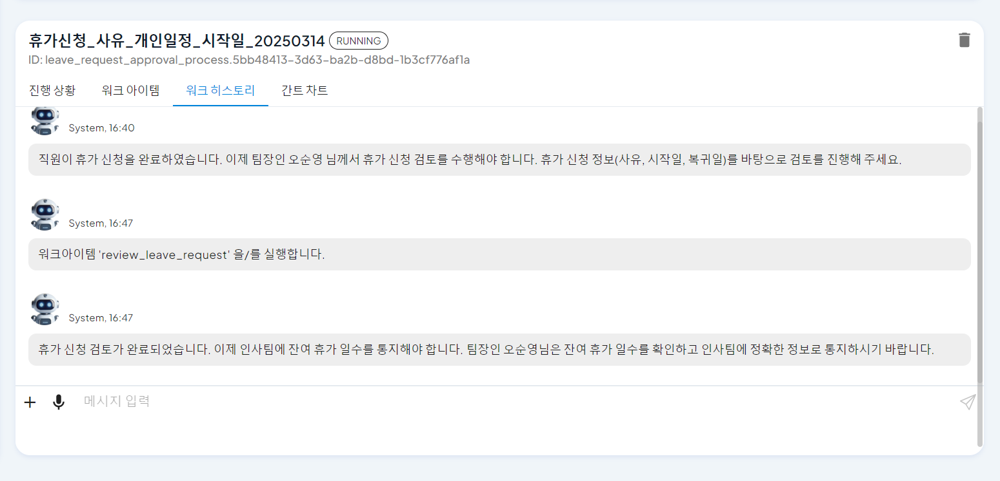

 

6. **프로세스 인스턴스 - 간트 차트**
   - 사용자는 간트 차트를 통해 워크아이템의 일정과 진행 상황을 시각적으로 확인할 수 있습니다.
      - 드래그 앤 드롭을 통해 각 워크아이템의 일정을 수정할 수 있습니다.
   - **[이미지-12]**: 프로세스 인스턴스 간트 차트 화면

      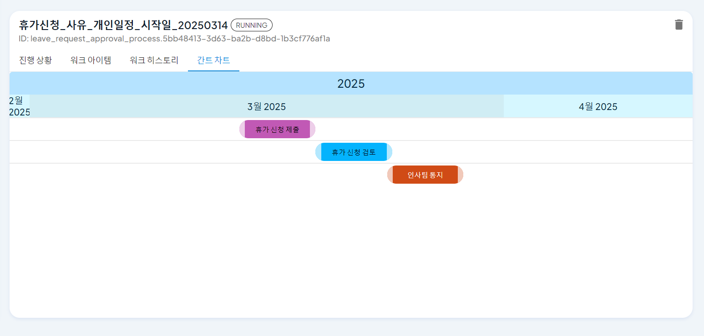

## 할 일 목록

1. **할 일 목록 조회**
   - 사용자는 할 일 목록에서 사용자에게 할당된 업무 목록을 조회할 수 있습니다.
      - 각 업무는 진행 상태에 따라 할 일, 진행 중, 보류 중, 완료 됨 으로 분류됩니다.
      - 업무는 BPM 표시가 붙은 인스턴스 업무와 일반 업무로 구분됩니다.

   - 사용자는 업무의 진행 상태를 드래그 앤 드롭으로 변경할 수 있습니다.

   - **[이미지-13]**: 전체 할 일 목록

      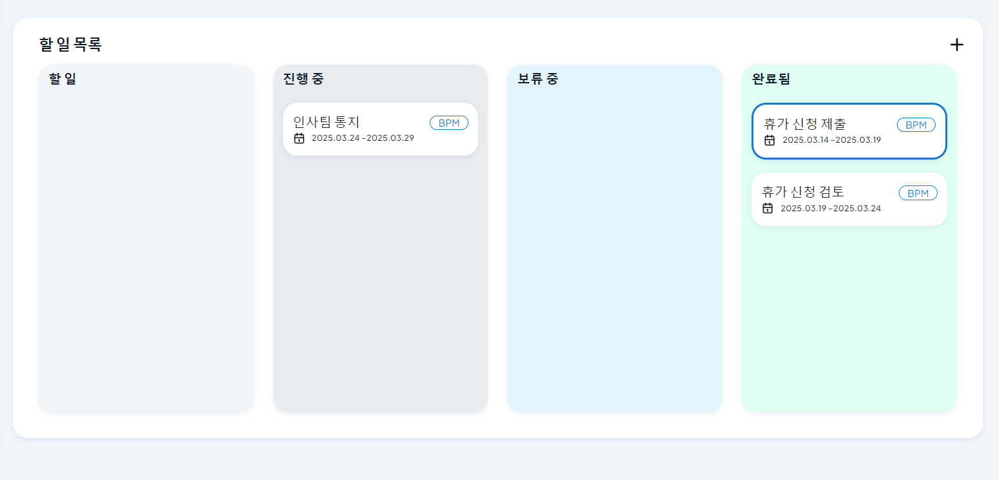

 

2. **할 일 등록**
   - 사용자는 새로운 업무를 추가할 수 있습니다.
      - 우측 상단 + 버튼을 통해 새로운 할 일 등록 화면을 호출합니다.
      - 할일명, 시작일, 종료일, 설명을 입력할 수 있습니다.
      - 추가된 업무는 할 일 목록에 표시됩니다.
   - **[이미지-14]**: 할 일 등록 화면

      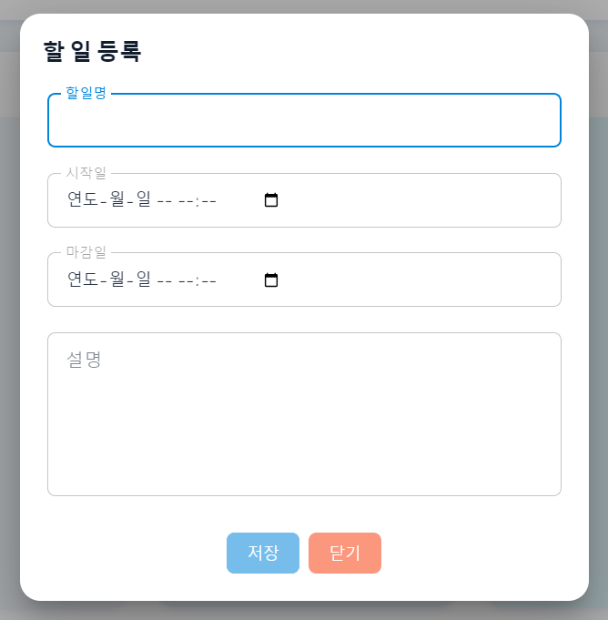

 

3. **할 일 수정**
   - 사용자는 등록한 업무의 진행 상태나 일정을 수정할 수 있습니다.
      - 업무를 클릭하면 등록한 업무의 상세 화면을 확인할 수 있습니다.
   - **[이미지-15]**: 할 일 상세 화면

      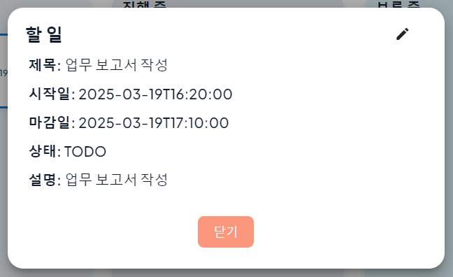

   - 할 일 상세 화면에서 우측 상단의 연필 아이콘 클릭시 할 일 수정 화면을 호출합니다.
      - 할일명, 시작일, 종료일, 설명을 수정할 수 있습니다.
   - **[이미지-16]**: 할 일 수정 화면

      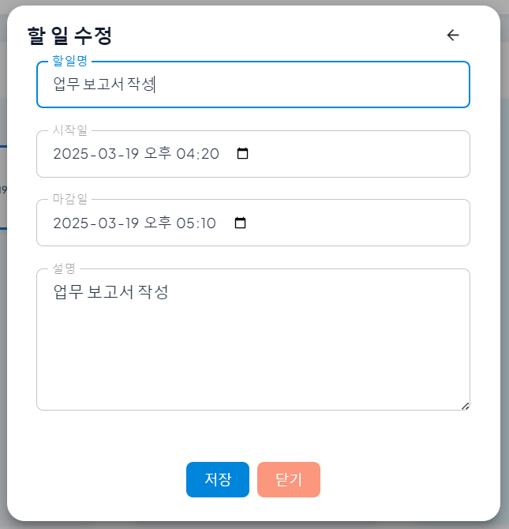

 

4. **할 일 삭제**
   - 업무의 더보기 버튼을 클릭하면 삭제 버튼을 확인할 수 있습니다.
      - 삭제 버튼 클릭시 해당 업무는 할 일 목록에서 삭제됩니다.
   - **[이미지-17]**: 할 일 삭제 화면

      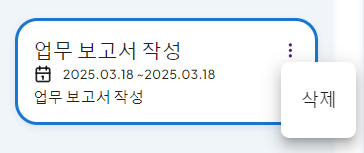

