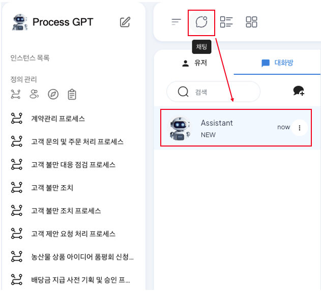
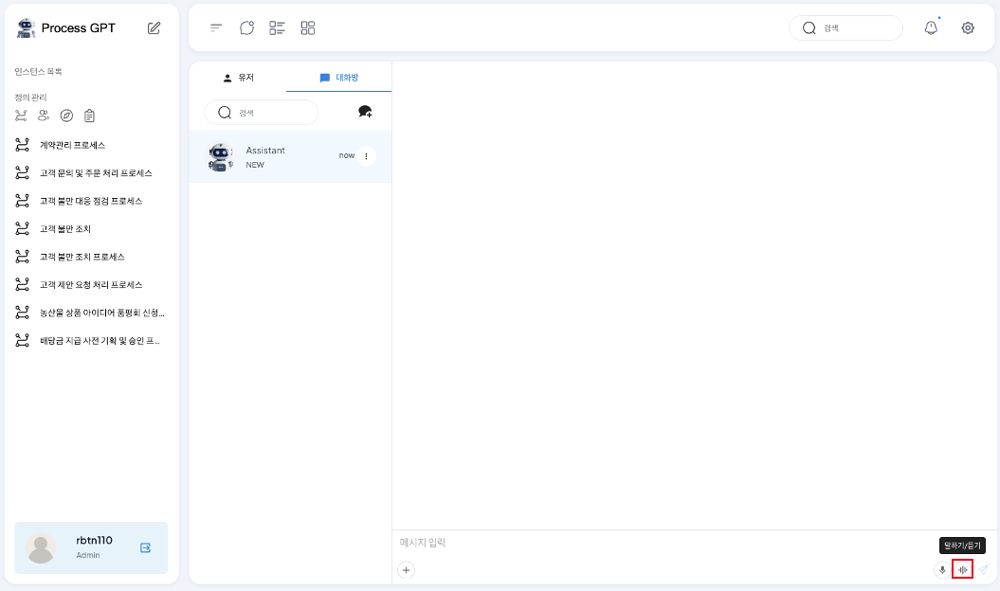
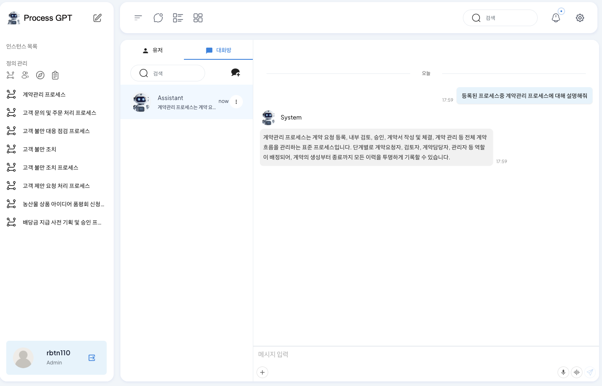

# 음성 기반 ProcessGPT

## 음성 채팅 기반 ProcessGPT

**음성 기반 ProcessGPT**는 테넌트에 생성된 정보를 기반으로 웹소켓을 활용한 인터페이스 지연 시간 단축을 통해 실제 채팅을 주고받듯이 빠른 속도로 요구사항 기반 답변을 제공하는 기능입니다. 

음성 기반 ProcessGPT는 테넌트 기반 테넌트에 등록된 프로세스 목록과 할 일 목록을 파악하여 사용자가 필요로 하는 정보를 찾아 답변하여 축적되는 복잡한 프로세스 정보를 손쉽게 파악할 수 있습니다  
또한, 사용자가 기획하고자 하는 프로세스와 요구사항을 음성으로 요청하면 그에 따른 세부 Task 정의와 세부 내용에 대해서 생성할 수 있습니다.

### 프로세스 목록 조회하기

음성 채팅을 이용하여 생성된 프로세스 목록을 확인하는 방법은 다음과 같습니다.

1. 상단 '채팅' 아이콘을 클릭하여 채팅 화면으로 진입한 다음, Assistant가 생성되었는지 확인합니다. 만약 생성되지 않았을 경우 채팅방 생성을 통해 System을 참여자로 추가하여 아래와 같은 화면이 나오는지 확인합니다.

2. 메세지 입력 영역 하단에 '말하기/듣기' 아이콘을 클릭하여 음성 채팅 화면으로 진입합니다.

3. 마이크 버튼을 클릭 후, '생성된 프로세스중 계약관리 프로세스에 대해 설명해줘'와 같이 내용을 확인하고 싶은 프로세스에 대하여 질문하는 음성 대화를 진행합니다.

4. 대화가 완료되면 잠시 후 AI가 등록된 프로세스중 계약관리 프로세스에 대해 각 task와 연결된 폼에 대한 정보를 음성 답변으로 진행해주며, AI답변을 채팅에서 확인할 수 있습니다.

### 프로세스 기획하기

음성 채팅을 이용하여 휴가 신청 프로세스를 기획하는 방법은 다음과 같습니다.

1. 메세지 입력 영역 하단에 '말하기/듣기' 아이콘을 클릭하여 음성 채팅 화면으로 진입합니다.

2. 마이크 버튼을 클릭 후, '휴가 신청 프로세스를 기획하기 위해 세부 task를 기획해줘'와 같이 기획하고 싶은 프로세스에 대한 요청을 진행합니다.

- 이때, 요청사항에 특정 요구사항을 추가할수록 더 세부적인 task 기획하여 응답하기 때문에 기획할 프로세스의 요구사항을 자세하게 요청합니다.

3. 대화가 완료되면 잠시 후 AI가 휴가 신청 프로세스에 대해 세부 task와 task에 포함되는 폼에 대한 내용을 기반으로 단계별로 음성 답변으로 진행해주며, AI답변을 채팅에서 확인할 수 있습니다.

이를 통해 사내 생성된 정보에 대한 빠른 이해와 프로세스 기획에 있어 세부 단계에 대한 가이드를 AI에게 지원받아 업무의 효율성을 향상시키며 프로세스의 품질을 향상시킬 수 있습니다.